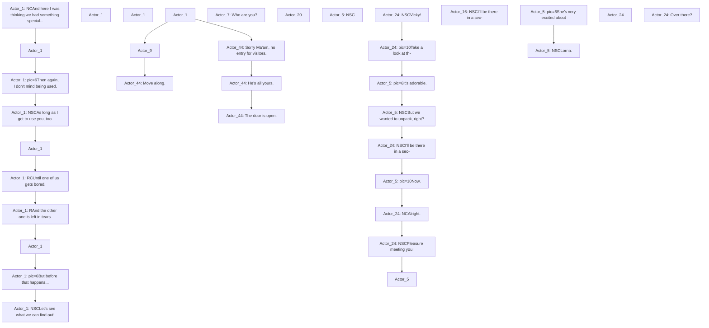

# Characters/Dalibor

```mermaid
graph TD
    61_0["Actor_1"]
    61_1["Actor_44: Sorry Ma'am, no entry for visitors."]
    61_2["Actor_44: He's all yours."]
    61_3["Actor_44: The door is open."]
    61_19["Actor_1"]
    61_26["Actor_1"]
    61_29["Actor_1: NCAnd here I was thinking we had something special..."]
    61_30["Actor_1"]
    61_31["Actor_1: pic=6Then again, I don't mind being used."]
    61_32["Actor_1: NSCAs long as I get to use you, too."]
    61_33["Actor_1"]
    61_34["Actor_1: pic=6But before that happens..."]
    61_36["Actor_1: NSCLet's see what we can find out!"]
    61_40["Actor_1: RCUntil one of us gets bored."]
    61_41["Actor_1: RAnd the other one is left in tears."]
    61_42["Actor_1"]
    61_75["Actor_7: Who are you?"]
    61_80["Actor_20"]
    61_83["Actor_9"]
    61_86["Actor_5: NSC"]
    61_88["Actor_5: NSCLorna."]
    61_90["Actor_24: NSCVicky!"]
    61_91["Actor_24: pic=10Take a look at th-"]
    61_92["Actor_5: pic=6It's adorable."]
    61_93["Actor_5: NSCBut we wanted to unpack, right?"]
    61_94["Actor_24: NSCI'll be there in a sec-"]
    61_95["Actor_5: pic=10Now."]
    61_96["Actor_16: NSCI'll be there in a sec-"]
    61_97["Actor_24: NCAlright."]
    61_98["Actor_24: NSCPleasure meeting you!"]
    61_102["Actor_5: pic=6She's very excited about "]
    61_104["Actor_24"]
    61_110["Actor_24: Over there?"]
    61_146["Actor_5"]
    61_149["Actor_44: Move along."]
    61_0 --> 61_83
    61_0 --> 61_1
    61_1 --> 61_2
    61_2 --> 61_3
    61_29 --> 61_30
    61_30 --> 61_31
    61_31 --> 61_32
    61_32 --> 61_33
    61_33 --> 61_40
    61_34 --> 61_36
    61_40 --> 61_41
    61_41 --> 61_42
    61_42 --> 61_34
    61_83 --> 61_149
    61_90 --> 61_91
    61_91 --> 61_92
    61_92 --> 61_93
    61_93 --> 61_94
    61_94 --> 61_95
    61_95 --> 61_97
    61_97 --> 61_98
    61_98 --> 61_146
    61_102 --> 61_88
```