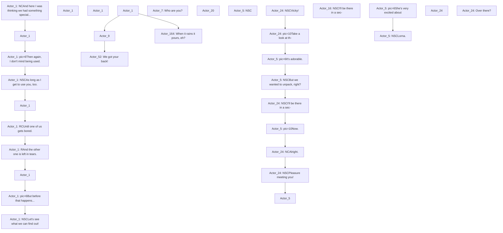

# Characters/Dan

```mermaid
graph TD
    75_0["Actor_1"]
    75_1["Actor_164: When it rains it pours, eh?"]
    75_19["Actor_1"]
    75_26["Actor_1"]
    75_29["Actor_1: NCAnd here I was thinking we had something special..."]
    75_30["Actor_1"]
    75_31["Actor_1: pic=6Then again, I don't mind being used."]
    75_32["Actor_1: NSCAs long as I get to use you, too."]
    75_33["Actor_1"]
    75_34["Actor_1: pic=6But before that happens..."]
    75_36["Actor_1: NSCLet's see what we can find out!"]
    75_40["Actor_1: RCUntil one of us gets bored."]
    75_41["Actor_1: RAnd the other one is left in tears."]
    75_42["Actor_1"]
    75_75["Actor_7: Who are you?"]
    75_80["Actor_20"]
    75_83["Actor_9"]
    75_86["Actor_5: NSC"]
    75_88["Actor_5: NSCLorna."]
    75_90["Actor_24: NSCVicky!"]
    75_91["Actor_24: pic=10Take a look at th-"]
    75_92["Actor_5: pic=6It's adorable."]
    75_93["Actor_5: NSCBut we wanted to unpack, right?"]
    75_94["Actor_24: NSCI'll be there in a sec-"]
    75_95["Actor_5: pic=10Now."]
    75_96["Actor_16: NSCI'll be there in a sec-"]
    75_97["Actor_24: NCAlright."]
    75_98["Actor_24: NSCPleasure meeting you!"]
    75_102["Actor_5: pic=6She's very excited about "]
    75_104["Actor_24"]
    75_110["Actor_24: Over there?"]
    75_146["Actor_5"]
    75_149["Actor_52: We got your back!"]
    75_0 --> 75_83
    75_0 --> 75_1
    75_29 --> 75_30
    75_30 --> 75_31
    75_31 --> 75_32
    75_32 --> 75_33
    75_33 --> 75_40
    75_34 --> 75_36
    75_40 --> 75_41
    75_41 --> 75_42
    75_42 --> 75_34
    75_83 --> 75_149
    75_90 --> 75_91
    75_91 --> 75_92
    75_92 --> 75_93
    75_93 --> 75_94
    75_94 --> 75_95
    75_95 --> 75_97
    75_97 --> 75_98
    75_98 --> 75_146
    75_102 --> 75_88
```