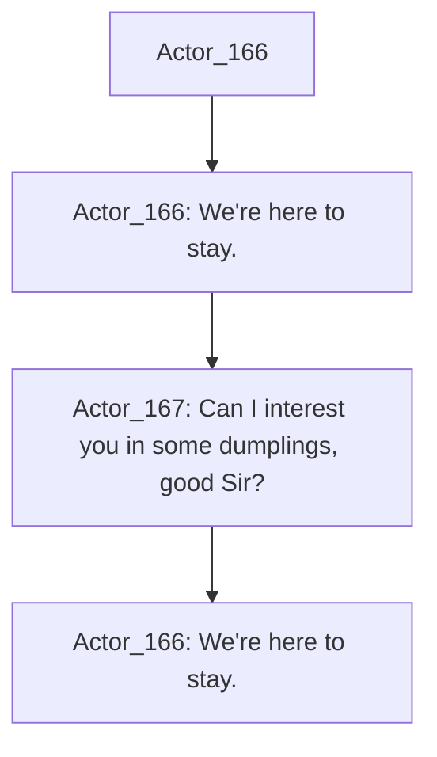

# Characters/Daniel

```mermaid
graph TD
    168_0["Actor_166"]
    168_1["Actor_166: We're here to stay."]
    168_2["Actor_167: Can I interest you in some dumplings, good Sir?"]
    168_3["Actor_166: We're here to stay."]
    168_0 --> 168_1
    168_1 --> 168_2
    168_2 --> 168_3
```