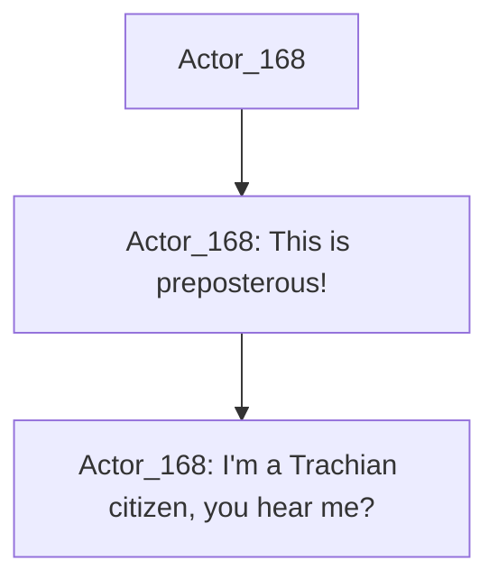

# Characters/Danilo

```mermaid
graph TD
    169_0["Actor_168"]
    169_1["Actor_168: This is preposterous!"]
    169_2["Actor_168: I'm a Trachian citizen, you hear me?"]
    169_0 --> 169_1
    169_1 --> 169_2
```