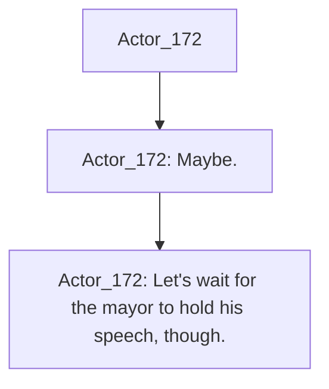

# Characters/Darko

```mermaid
graph TD
    172_0["Actor_172"]
    172_1["Actor_172: Maybe."]
    172_2["Actor_172: Let's wait for the mayor to hold his speech, though."]
    172_0 --> 172_1
    172_1 --> 172_2
```