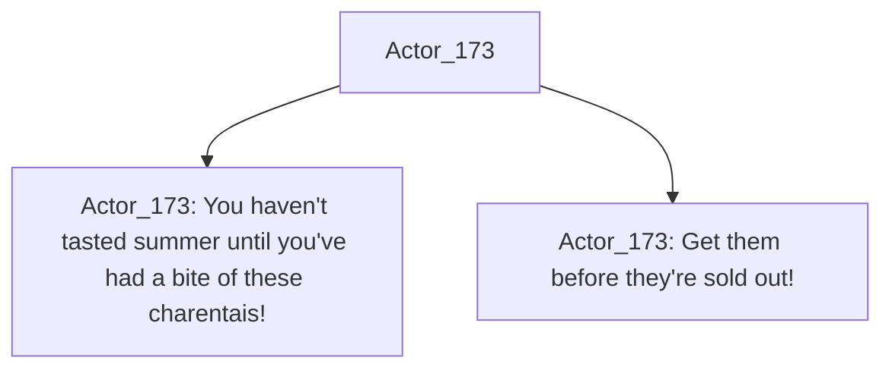

# Characters/Davit

```mermaid
graph TD
    173_0["Actor_173"]
    173_1["Actor_173: You haven't tasted summer until you've had a bite of these charentais!"]
    173_2["Actor_173: Get them before they're sold out!"]
    173_0 --> 173_1
    173_0 --> 173_2
```