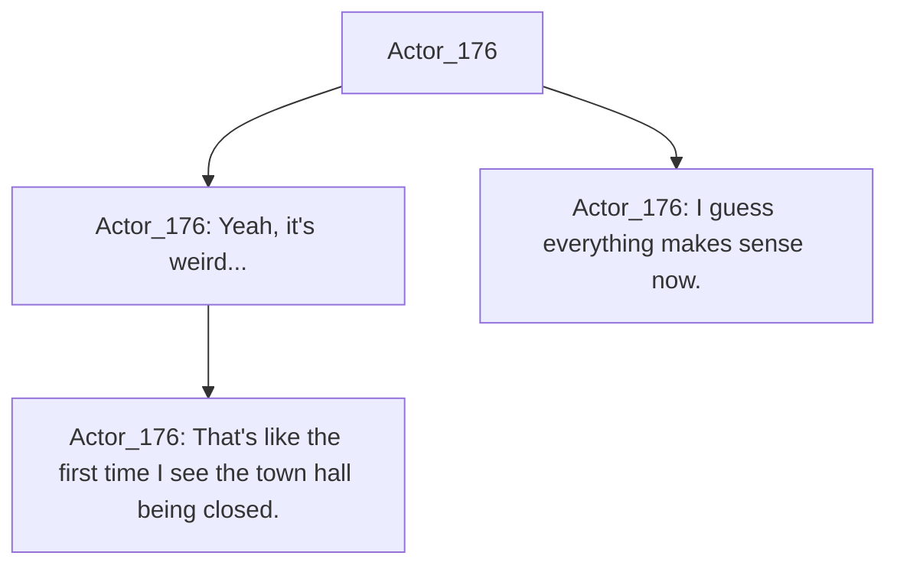

# Characters/Denis

```mermaid
graph TD
    176_0["Actor_176"]
    176_1["Actor_176: Yeah, it's weird..."]
    176_2["Actor_176: That's like the first time I see the town hall being closed."]
    176_3["Actor_176: I guess everything makes sense now."]
    176_0 --> 176_1
    176_0 --> 176_3
    176_1 --> 176_2
```