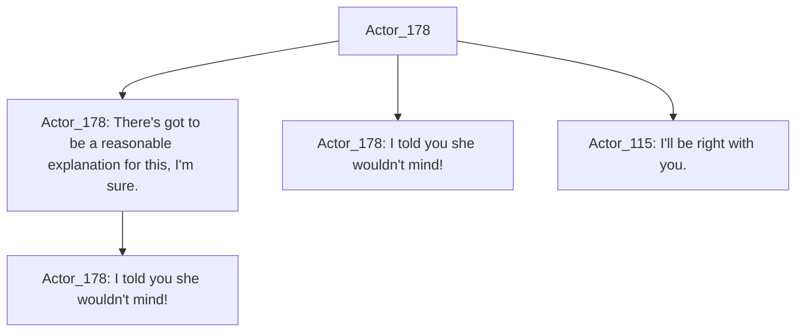

# Characters/Dima

```mermaid
graph TD
    178_0["Actor_178"]
    178_1["Actor_178: There's got to be a reasonable explanation for this, I'm sure."]
    178_2["Actor_178: I told you she wouldn't mind!"]
    178_3["Actor_178: I told you she wouldn't mind!"]
    178_4["Actor_115: I'll be right with you."]
    178_0 --> 178_1
    178_0 --> 178_3
    178_0 --> 178_4
    178_1 --> 178_2
```