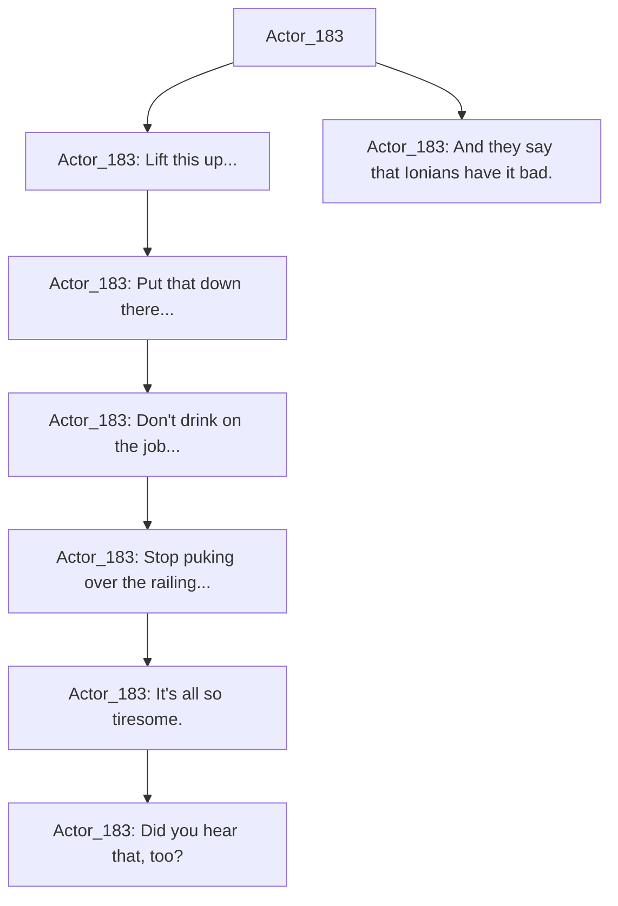

# Characters/Diogo

```mermaid
graph TD
    182_0["Actor_183"]
    182_1["Actor_183: Lift this up..."]
    182_2["Actor_183: Put that down there..."]
    182_3["Actor_183: Don't drink on the job..."]
    182_4["Actor_183: Stop puking over the railing..."]
    182_5["Actor_183: It's all so tiresome."]
    182_6["Actor_183: Did you hear that, too?"]
    182_7["Actor_183: And they say that Ionians have it bad."]
    182_0 --> 182_1
    182_0 --> 182_7
    182_1 --> 182_2
    182_2 --> 182_3
    182_3 --> 182_4
    182_4 --> 182_5
    182_5 --> 182_6
```