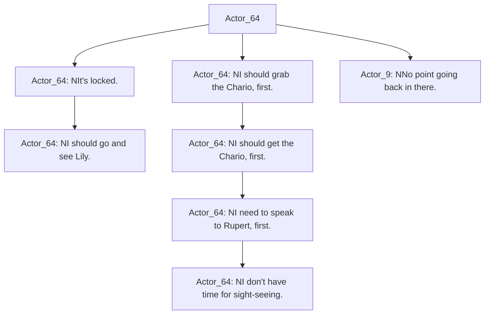

# Characters/Drenem

```mermaid
graph TD
    184_0["Actor_64"]
    184_1["Actor_64: NIt's locked."]
    184_2["Actor_64: NI should go and see Lily."]
    184_3["Actor_64: NI should grab the Chario, first."]
    184_4["Actor_64: NI should get the Chario, first."]
    184_5["Actor_64: NI need to speak to Rupert, first."]
    184_6["Actor_64: NI don't have time for sight-seeing."]
    184_7["Actor_9: NNo point going back in there."]
    184_0 --> 184_1
    184_0 --> 184_3
    184_0 --> 184_7
    184_1 --> 184_2
    184_3 --> 184_4
    184_4 --> 184_5
    184_5 --> 184_6
```