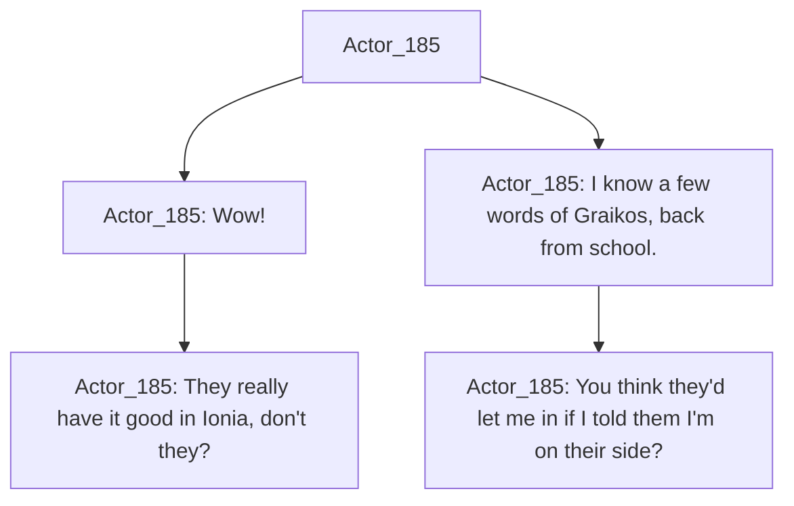

# Characters/Earnestine

```mermaid
graph TD
    185_0["Actor_185"]
    185_1["Actor_185: Wow!"]
    185_2["Actor_185: They really have it good in Ionia, don't they?"]
    185_3["Actor_185: I know a few words of Graikos, back from school."]
    185_4["Actor_185: You think they'd let me in if I told them I'm on their side?"]
    185_0 --> 185_1
    185_0 --> 185_3
    185_1 --> 185_2
    185_3 --> 185_4
```