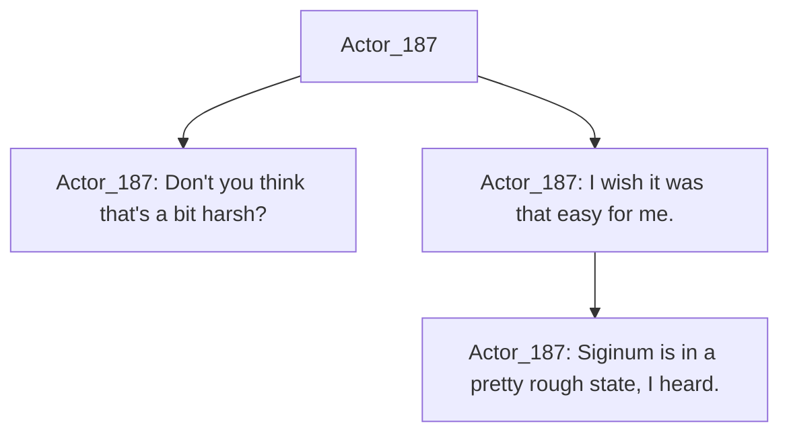

# Characters/Edgars

```mermaid
graph TD
    187_0["Actor_187"]
    187_1["Actor_187: Don't you think that's a bit harsh?"]
    187_2["Actor_187: I wish it was that easy for me."]
    187_3["Actor_187: Siginum is in a pretty rough state, I heard."]
    187_0 --> 187_1
    187_0 --> 187_2
    187_2 --> 187_3
```