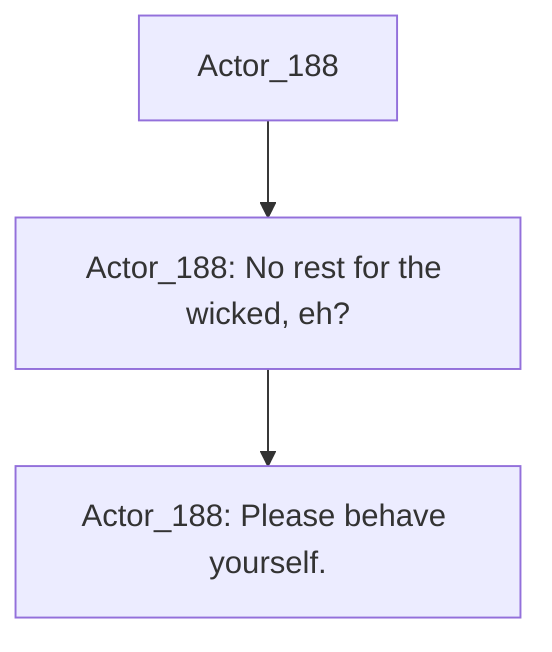

# Characters/Eduard

```mermaid
graph TD
    188_0["Actor_188"]
    188_1["Actor_188: No rest for the wicked, eh?"]
    188_2["Actor_188: Please behave yourself."]
    188_0 --> 188_1
    188_1 --> 188_2
```