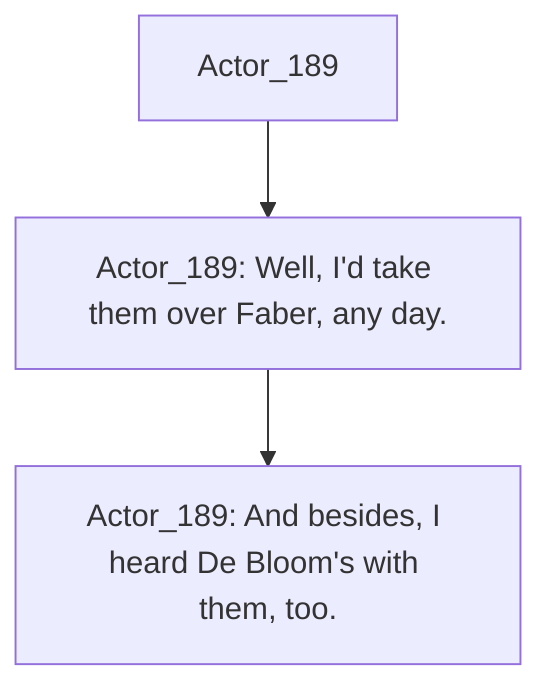

# Characters/Edvard

```mermaid
graph TD
    189_0["Actor_189"]
    189_1["Actor_189: Well, I'd take them over Faber, any day."]
    189_2["Actor_189: And besides, I heard De Bloom's with them, too."]
    189_0 --> 189_1
    189_1 --> 189_2
```