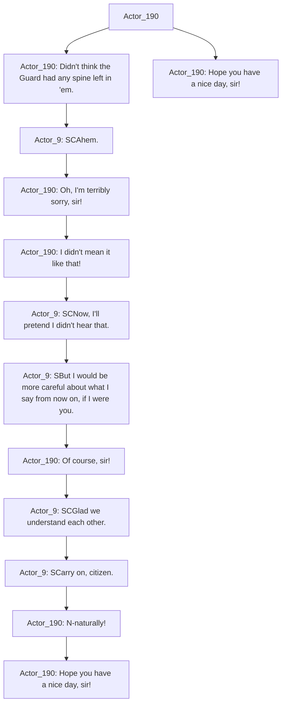

# Characters/Edward

```mermaid
graph TD
    190_0["Actor_190"]
    190_1["Actor_190: Didn't think the Guard had any spine left in 'em."]
    190_2["Actor_9: SCAhem."]
    190_3["Actor_190: Oh, I'm terribly sorry, sir!"]
    190_4["Actor_190: I didn't mean it like that!"]
    190_5["Actor_9: SCNow, I'll pretend I didn't hear that."]
    190_6["Actor_9: SBut I would be more careful about what I say from now on, if I were you."]
    190_7["Actor_190: Of course, sir!"]
    190_8["Actor_9: SCGlad we understand each other."]
    190_9["Actor_9: SCarry on, citizen."]
    190_10["Actor_190: N-naturally!"]
    190_11["Actor_190: Hope you have a nice day, sir!"]
    190_12["Actor_190: Hope you have a nice day, sir!"]
    190_0 --> 190_1
    190_0 --> 190_12
    190_1 --> 190_2
    190_2 --> 190_3
    190_3 --> 190_4
    190_4 --> 190_5
    190_5 --> 190_6
    190_6 --> 190_7
    190_7 --> 190_8
    190_8 --> 190_9
    190_9 --> 190_10
    190_10 --> 190_11
```