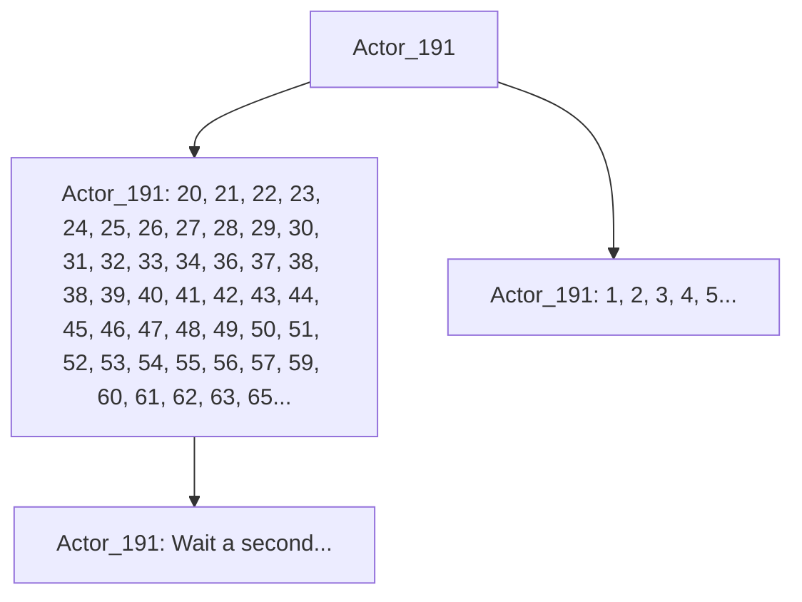

# Characters/Ekber

```mermaid
graph TD
    191_0["Actor_191"]
    191_1["Actor_191: 20, 21, 22, 23, 24, 25, 26, 27, 28, 29, 30, 31, 32, 33, 34, 36, 37, 38, 38, 39, 40, 41, 42, 43, 44, 45, 46, 47, 48, 49, 50, 51, 52, 53, 54, 55, 56, 57, 59, 60, 61, 62, 63, 65..."]
    191_2["Actor_191: Wait a second..."]
    191_3["Actor_191: 1, 2, 3, 4, 5..."]
    191_0 --> 191_1
    191_0 --> 191_3
    191_1 --> 191_2
```