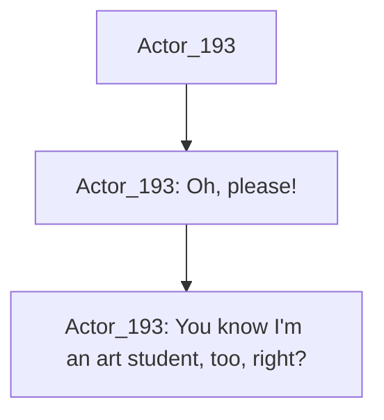

# Characters/Elene

```mermaid
graph TD
    193_0["Actor_193"]
    193_1["Actor_193: Oh, please!"]
    193_2["Actor_193: You know I'm an art student, too, right?"]
    193_0 --> 193_1
    193_1 --> 193_2
```