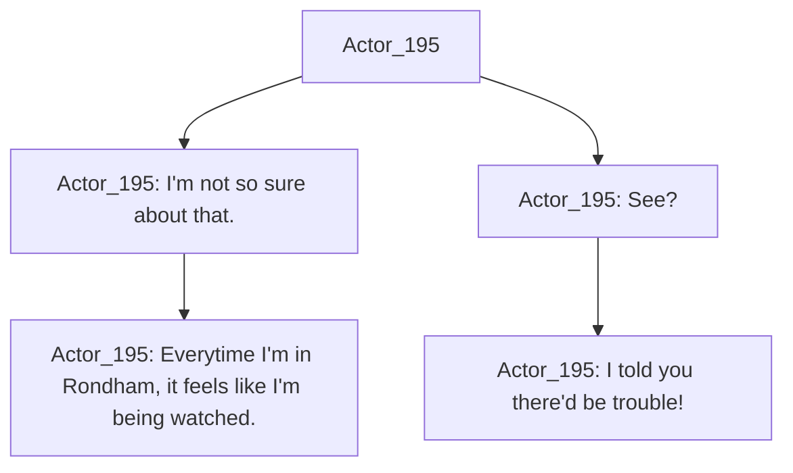

# Characters/Eliav

```mermaid
graph TD
    195_0["Actor_195"]
    195_1["Actor_195: I'm not so sure about that."]
    195_2["Actor_195: Everytime I'm in Rondham, it feels like I'm being watched."]
    195_3["Actor_195: See?"]
    195_4["Actor_195: I told you there'd be trouble!"]
    195_0 --> 195_1
    195_0 --> 195_3
    195_1 --> 195_2
    195_3 --> 195_4
```