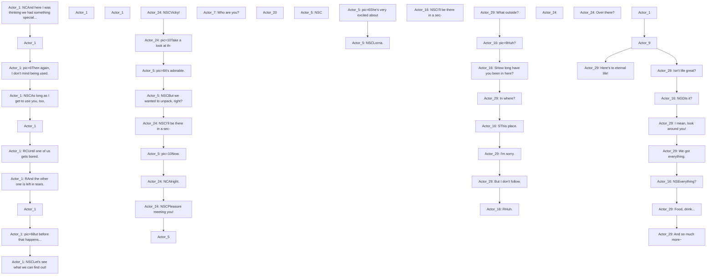

# Characters/Emilia

```mermaid
graph TD
    45_0["Actor_1"]
    45_19["Actor_1"]
    45_26["Actor_1"]
    45_29["Actor_1: NCAnd here I was thinking we had something special..."]
    45_30["Actor_1"]
    45_31["Actor_1: pic=6Then again, I don't mind being used."]
    45_32["Actor_1: NSCAs long as I get to use you, too."]
    45_33["Actor_1"]
    45_34["Actor_1: pic=6But before that happens..."]
    45_36["Actor_1: NSCLet's see what we can find out!"]
    45_40["Actor_1: RCUntil one of us gets bored."]
    45_41["Actor_1: RAnd the other one is left in tears."]
    45_42["Actor_1"]
    45_75["Actor_7: Who are you?"]
    45_80["Actor_20"]
    45_83["Actor_9"]
    45_86["Actor_5: NSC"]
    45_88["Actor_5: NSCLorna."]
    45_90["Actor_24: NSCVicky!"]
    45_91["Actor_24: pic=10Take a look at th-"]
    45_92["Actor_5: pic=6It's adorable."]
    45_93["Actor_5: NSCBut we wanted to unpack, right?"]
    45_94["Actor_24: NSCI'll be there in a sec-"]
    45_95["Actor_5: pic=10Now."]
    45_96["Actor_16: NSCI'll be there in a sec-"]
    45_97["Actor_24: NCAlright."]
    45_98["Actor_24: NSCPleasure meeting you!"]
    45_102["Actor_5: pic=6She's very excited about "]
    45_104["Actor_24"]
    45_110["Actor_24: Over there?"]
    45_146["Actor_5"]
    45_149["Actor_29: Isn't life great?"]
    45_150["Actor_29: Here's to eternal life!"]
    45_154["Actor_16: NGDIs it?"]
    45_155["Actor_29: I mean, look around you!"]
    45_156["Actor_29: We got everything."]
    45_157["Actor_16: NSEverything?"]
    45_158["Actor_29: What outside?"]
    45_159["Actor_16: pic=9Huh?"]
    45_160["Actor_29: In where?"]
    45_161["Actor_16: SHow long have you been in here?"]
    45_162["Actor_16: SThis place."]
    45_163["Actor_29: I'm sorry."]
    45_164["Actor_29: But I don't follow."]
    45_165["Actor_16: RHuh."]
    45_167["Actor_29: Food, drink..."]
    45_168["Actor_29: And so much more~"]
    45_0 --> 45_83
    45_29 --> 45_30
    45_30 --> 45_31
    45_31 --> 45_32
    45_32 --> 45_33
    45_33 --> 45_40
    45_34 --> 45_36
    45_40 --> 45_41
    45_41 --> 45_42
    45_42 --> 45_34
    45_83 --> 45_149
    45_83 --> 45_150
    45_90 --> 45_91
    45_91 --> 45_92
    45_92 --> 45_93
    45_93 --> 45_94
    45_94 --> 45_95
    45_95 --> 45_97
    45_97 --> 45_98
    45_98 --> 45_146
    45_102 --> 45_88
    45_149 --> 45_154
    45_154 --> 45_155
    45_155 --> 45_156
    45_156 --> 45_157
    45_157 --> 45_167
    45_158 --> 45_159
    45_159 --> 45_161
    45_160 --> 45_162
    45_161 --> 45_160
    45_162 --> 45_163
    45_163 --> 45_164
    45_164 --> 45_165
    45_167 --> 45_168
```