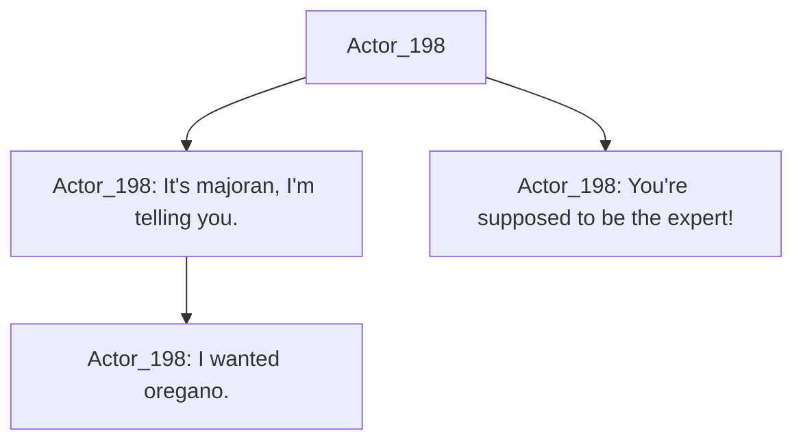

# Characters/Emilija

```mermaid
graph TD
    198_0["Actor_198"]
    198_1["Actor_198: It's majoran, I'm telling you."]
    198_2["Actor_198: I wanted oregano."]
    198_3["Actor_198: You're supposed to be the expert!"]
    198_0 --> 198_1
    198_0 --> 198_3
    198_1 --> 198_2
```