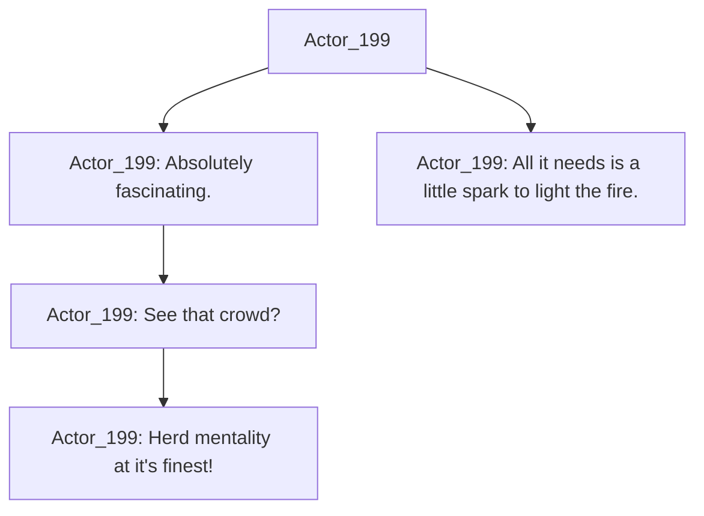

# Characters/Emiliyan

```mermaid
graph TD
    199_0["Actor_199"]
    199_1["Actor_199: Absolutely fascinating."]
    199_2["Actor_199: See that crowd?"]
    199_3["Actor_199: Herd mentality at it's finest!"]
    199_4["Actor_199: All it needs is a little spark to light the fire."]
    199_0 --> 199_1
    199_0 --> 199_4
    199_1 --> 199_2
    199_2 --> 199_3
```