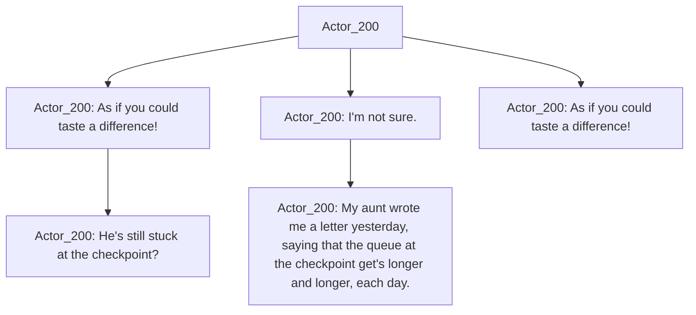

# Characters/Endrit

```mermaid
graph TD
    200_0["Actor_200"]
    200_1["Actor_200: As if you could taste a difference!"]
    200_2["Actor_200: He's still stuck at the checkpoint?"]
    200_3["Actor_200: I'm not sure."]
    200_4["Actor_200: My aunt wrote me a letter yesterday, saying that the queue at the checkpoint get's longer and longer, each day."]
    200_5["Actor_200: As if you could taste a difference!"]
    200_0 --> 200_1
    200_0 --> 200_3
    200_0 --> 200_5
    200_1 --> 200_2
    200_3 --> 200_4
```