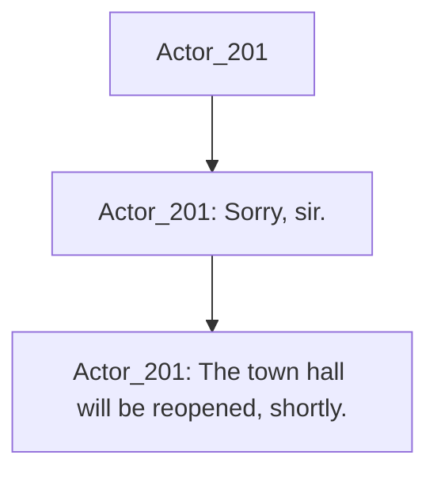

# Characters/Ernest

```mermaid
graph TD
    201_0["Actor_201"]
    201_1["Actor_201: Sorry, sir."]
    201_2["Actor_201: The town hall will be reopened, shortly."]
    201_0 --> 201_1
    201_1 --> 201_2
```