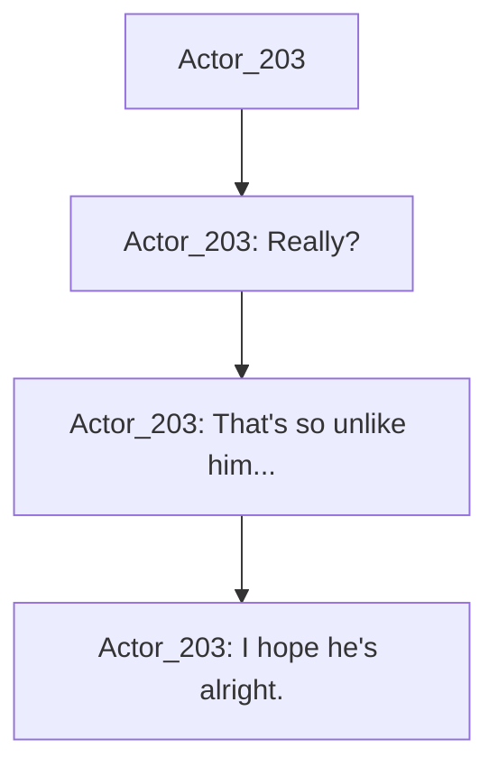

# Characters/Eulalia

```mermaid
graph TD
    203_0["Actor_203"]
    203_1["Actor_203: Really?"]
    203_2["Actor_203: That's so unlike him..."]
    203_3["Actor_203: I hope he's alright."]
    203_0 --> 203_1
    203_1 --> 203_2
    203_2 --> 203_3
```