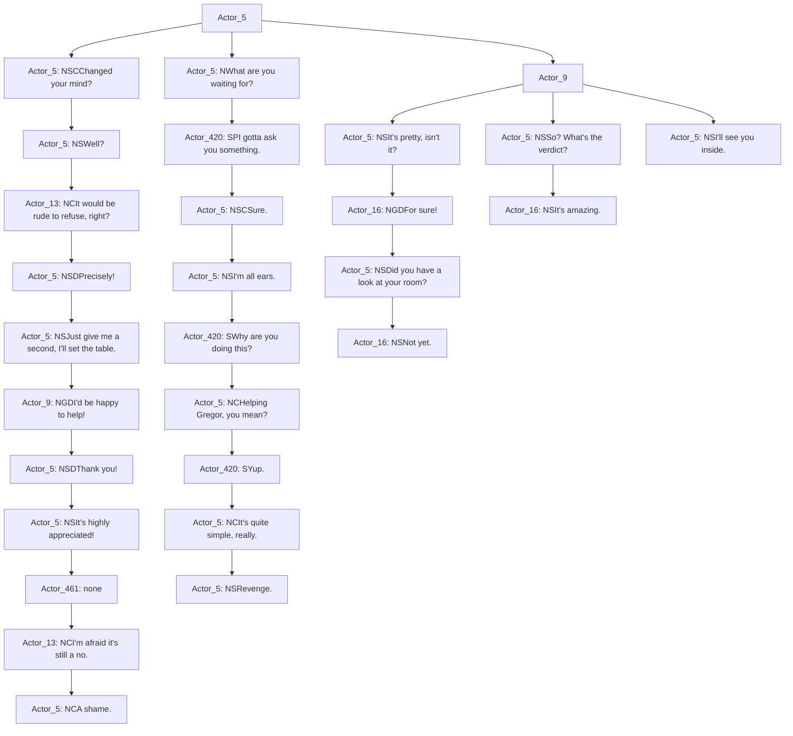

# Characters/Eurydice

```mermaid
graph TD
    33_0["Actor_5"]
    33_1["Actor_5: NSCChanged your mind?"]
    33_2["Actor_5: NSWell?"]
    33_3["Actor_13: NCIt would be rude to refuse, right?"]
    33_4["Actor_5: NSDPrecisely!"]
    33_5["Actor_5: NSJust give me a second, I'll set the table."]
    33_6["Actor_9: NGDI'd be happy to help!"]
    33_7["Actor_5: NSDThank you!"]
    33_8["Actor_5: NSIt's highly appreciated!"]
    33_9["Actor_461: none"]
    33_10["Actor_13: NCI'm afraid it's still a no."]
    33_11["Actor_5: NCA shame."]
    33_12["Actor_5: NWhat are you waiting for?"]
    33_13["Actor_420: SPI gotta ask you something."]
    33_14["Actor_5: NSCSure."]
    33_15["Actor_5: NSI'm all ears."]
    33_16["Actor_420: SWhy are you doing this?"]
    33_17["Actor_5: NCHelping Gregor, you mean?"]
    33_18["Actor_420: SYup."]
    33_19["Actor_5: NCIt's quite simple, really."]
    33_20["Actor_5: NSRevenge."]
    33_83["Actor_9"]
    33_84["Actor_5: NSIt's pretty, isn't it?"]
    33_85["Actor_16: NGDFor sure!"]
    33_89["Actor_16: NSNot yet."]
    33_101["Actor_5: NSDid you have a look at your room?"]
    33_103["Actor_5: NSSo? What's the verdict?"]
    33_106["Actor_16: NSIt's amazing."]
    33_149["Actor_5: NSI'll see you inside."]
    33_0 --> 33_83
    33_0 --> 33_1
    33_0 --> 33_12
    33_1 --> 33_2
    33_2 --> 33_3
    33_3 --> 33_4
    33_4 --> 33_5
    33_5 --> 33_6
    33_6 --> 33_7
    33_7 --> 33_8
    33_8 --> 33_9
    33_9 --> 33_10
    33_10 --> 33_11
    33_12 --> 33_13
    33_13 --> 33_14
    33_14 --> 33_15
    33_15 --> 33_16
    33_16 --> 33_17
    33_17 --> 33_18
    33_18 --> 33_19
    33_19 --> 33_20
    33_83 --> 33_149
    33_83 --> 33_84
    33_83 --> 33_103
    33_84 --> 33_85
    33_85 --> 33_101
    33_101 --> 33_89
    33_103 --> 33_106
```