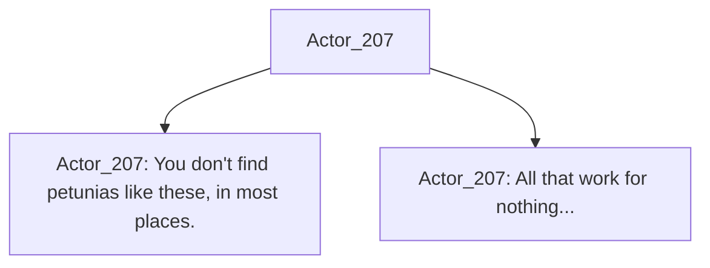

# Characters/Felix

```mermaid
graph TD
    207_0["Actor_207"]
    207_1["Actor_207: You don't find petunias like these, in most places."]
    207_2["Actor_207: All that work for nothing..."]
    207_0 --> 207_1
    207_0 --> 207_2
```