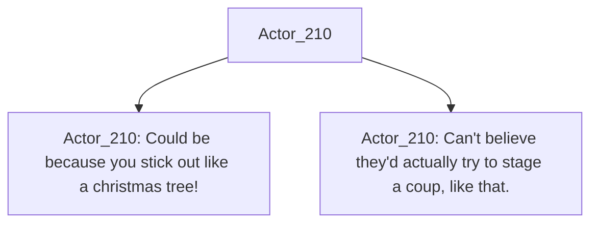

# Characters/Finlay

```mermaid
graph TD
    210_0["Actor_210"]
    210_1["Actor_210: Could be because you stick out like a christmas tree!"]
    210_2["Actor_210: Can't believe they'd actually try to stage a coup, like that."]
    210_0 --> 210_1
    210_0 --> 210_2
```