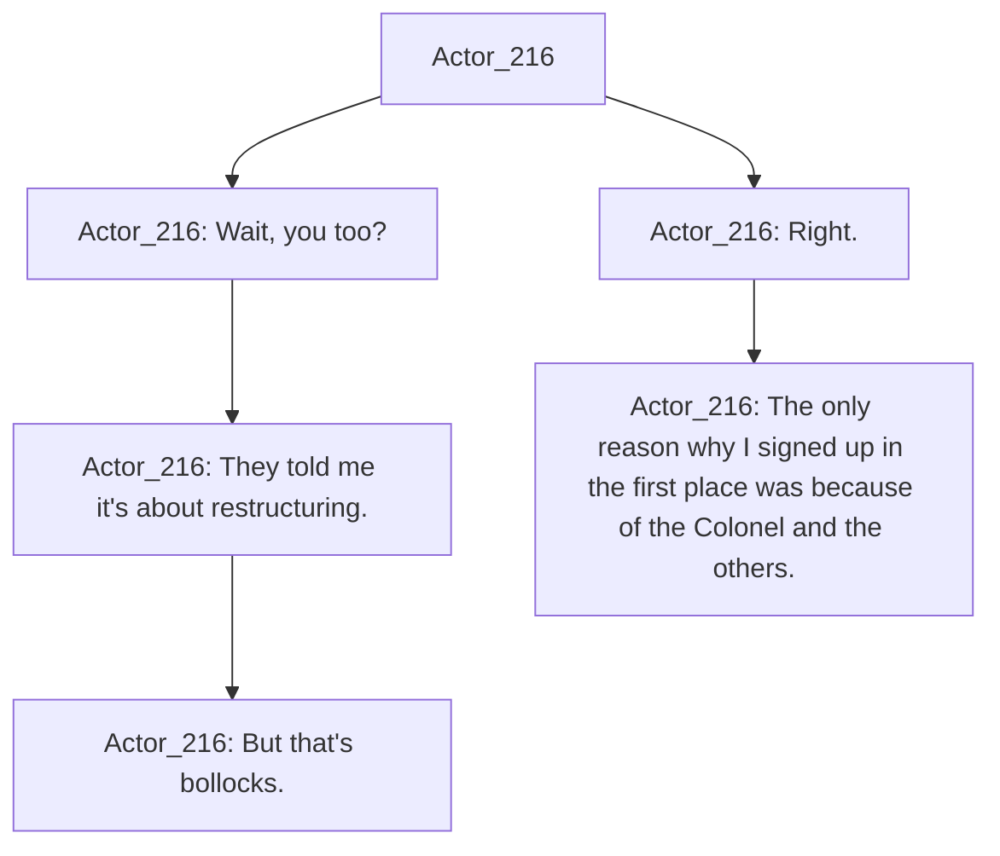

# Characters/Frankie

```mermaid
graph TD
    216_0["Actor_216"]
    216_1["Actor_216: Wait, you too?"]
    216_2["Actor_216: They told me it's about restructuring."]
    216_3["Actor_216: But that's bollocks."]
    216_4["Actor_216: Right."]
    216_5["Actor_216: The only reason why I signed up in the first place was because of the Colonel and the others."]
    216_0 --> 216_1
    216_0 --> 216_4
    216_1 --> 216_2
    216_2 --> 216_3
    216_4 --> 216_5
```