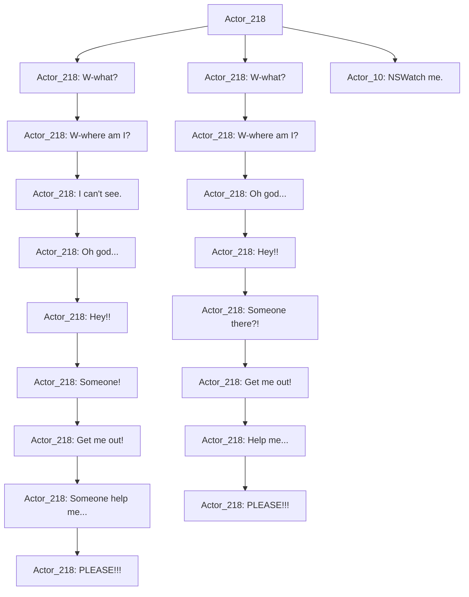

# Characters/Franziska

```mermaid
graph TD
    218_0["Actor_218"]
    218_1["Actor_218: W-what?"]
    218_2["Actor_218: W-where am I?"]
    218_3["Actor_218: I can't see."]
    218_4["Actor_218: Oh god..."]
    218_5["Actor_218: Hey!!"]
    218_6["Actor_218: Someone!"]
    218_7["Actor_218: Get me out!"]
    218_8["Actor_218: Someone help me..."]
    218_9["Actor_218: PLEASE!!!"]
    218_10["Actor_218: W-what?"]
    218_11["Actor_218: W-where am I?"]
    218_12["Actor_218: Oh god..."]
    218_13["Actor_218: Hey!!"]
    218_14["Actor_218: Someone there?!"]
    218_15["Actor_218: Get me out!"]
    218_16["Actor_218: Help me..."]
    218_17["Actor_218: PLEASE!!!"]
    218_18["Actor_10: NSWatch me."]
    218_0 --> 218_1
    218_0 --> 218_10
    218_0 --> 218_18
    218_1 --> 218_2
    218_2 --> 218_3
    218_3 --> 218_4
    218_4 --> 218_5
    218_5 --> 218_6
    218_6 --> 218_7
    218_7 --> 218_8
    218_8 --> 218_9
    218_10 --> 218_11
    218_11 --> 218_12
    218_12 --> 218_13
    218_13 --> 218_14
    218_14 --> 218_15
    218_15 --> 218_16
    218_16 --> 218_17
```