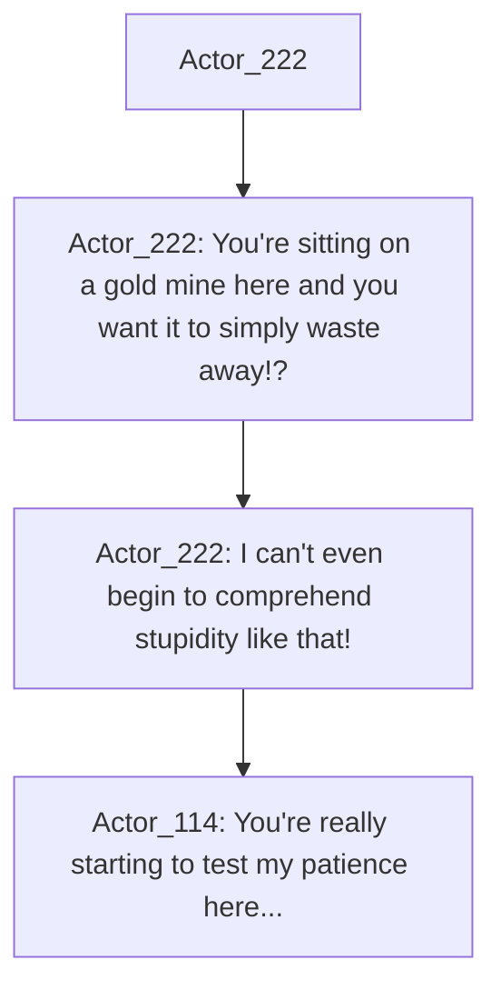

# Characters/Gabe

```mermaid
graph TD
    222_0["Actor_222"]
    222_1["Actor_222: You're sitting on a gold mine here and you want it to simply waste away!?"]
    222_2["Actor_222: I can't even begin to comprehend stupidity like that!"]
    222_3["Actor_114: You're really starting to test my patience here..."]
    222_0 --> 222_1
    222_1 --> 222_2
    222_2 --> 222_3
```