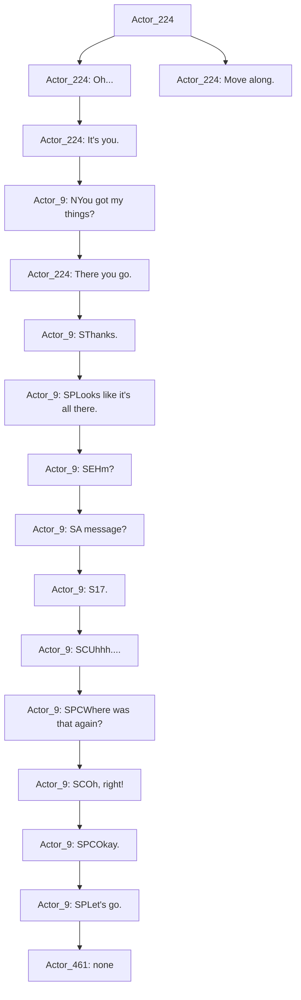

# Characters/Gael

```mermaid
graph TD
    224_0["Actor_224"]
    224_1["Actor_224: Oh..."]
    224_2["Actor_224: It's you."]
    224_3["Actor_9: NYou got my things?"]
    224_4["Actor_224: There you go."]
    224_5["Actor_9: SThanks."]
    224_6["Actor_9: SPLooks like it's all there."]
    224_7["Actor_9: SEHm?"]
    224_8["Actor_9: SA message?"]
    224_9["Actor_9: S17."]
    224_10["Actor_9: SCUhhh...."]
    224_11["Actor_9: SPCWhere was that again?"]
    224_12["Actor_9: SCOh, right!"]
    224_13["Actor_9: SPCOkay."]
    224_14["Actor_9: SPLet's go."]
    224_15["Actor_461: none"]
    224_16["Actor_224: Move along."]
    224_0 --> 224_1
    224_0 --> 224_16
    224_1 --> 224_2
    224_2 --> 224_3
    224_3 --> 224_4
    224_4 --> 224_5
    224_5 --> 224_6
    224_6 --> 224_7
    224_7 --> 224_8
    224_8 --> 224_9
    224_9 --> 224_10
    224_10 --> 224_11
    224_11 --> 224_12
    224_12 --> 224_13
    224_13 --> 224_14
    224_14 --> 224_15
```