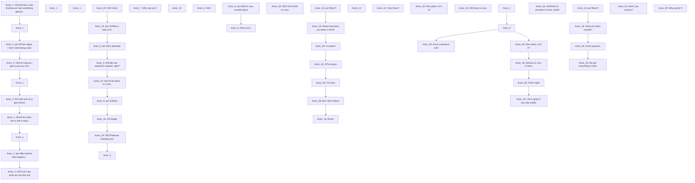

# Characters/Genadi

```mermaid
graph TD
    46_0["Actor_1"]
    46_19["Actor_1"]
    46_26["Actor_1"]
    46_29["Actor_1: NCAnd here I was thinking we had something special..."]
    46_30["Actor_1"]
    46_31["Actor_1: pic=6Then again, I don't mind being used."]
    46_32["Actor_1: NSCAs long as I get to use you, too."]
    46_33["Actor_1"]
    46_34["Actor_1: pic=6But before that happens..."]
    46_36["Actor_1: NSCLet's see what we can find out!"]
    46_40["Actor_1: RCUntil one of us gets bored."]
    46_41["Actor_1: RAnd the other one is left in tears."]
    46_42["Actor_1"]
    46_75["Actor_7: Who are you?"]
    46_80["Actor_20"]
    46_83["Actor_9"]
    46_86["Actor_5: NSC"]
    46_88["Actor_5: NSCLorna."]
    46_90["Actor_24: NSCVicky!"]
    46_91["Actor_24: pic=10Take a look at th-"]
    46_92["Actor_5: pic=6It's adorable."]
    46_93["Actor_5: NSCBut we wanted to unpack, right?"]
    46_94["Actor_24: NSCI'll be there in a sec-"]
    46_95["Actor_5: pic=10Now."]
    46_96["Actor_16: NSCI'll be there in a sec-"]
    46_97["Actor_24: NCAlright."]
    46_98["Actor_24: NSCPleasure meeting you!"]
    46_102["Actor_5: pic=6She's very excited about "]
    46_104["Actor_24"]
    46_110["Actor_24: Over there?"]
    46_146["Actor_5"]
    46_149["Actor_30: Nice place, isn't it?"]
    46_150["Actor_30: Have a pleasant one!"]
    46_151["Actor_16: NSSure is cozy in here."]
    46_152["Actor_30: Nice place, isn't it?"]
    46_153["Actor_16: NSCSure is cozy."]
    46_166["Actor_29: Good question."]
    46_167["Actor_16: pic=9Huh?"]
    46_168["Actor_29: In where?"]
    46_169["Actor_16: SHow long have you been in here?"]
    46_170["Actor_16: SThis place."]
    46_171["Actor_29: I'm sorry."]
    46_172["Actor_29: But I don't follow."]
    46_173["Actor_16: RHuh."]
    46_174["Actor_16: NGDAnd no monsters in here, either!"]
    46_175["Actor_30: That's right!"]
    46_176["Actor_16: pic=9Huh?"]
    46_177["Actor_16: Have you been outside?"]
    46_178["Actor_16: Aren't you curious?"]
    46_179["Actor_29: Why would I?"]
    46_180["Actor_29: We got everything in here."]
    46_181["Actor_30: Life is great if you stay inside."]
    46_0 --> 46_83
    46_29 --> 46_30
    46_30 --> 46_31
    46_31 --> 46_32
    46_32 --> 46_33
    46_33 --> 46_40
    46_34 --> 46_36
    46_40 --> 46_41
    46_41 --> 46_42
    46_42 --> 46_34
    46_83 --> 46_149
    46_83 --> 46_150
    46_90 --> 46_91
    46_91 --> 46_92
    46_92 --> 46_93
    46_93 --> 46_94
    46_94 --> 46_95
    46_95 --> 46_97
    46_97 --> 46_98
    46_98 --> 46_146
    46_102 --> 46_88
    46_149 --> 46_151
    46_151 --> 46_175
    46_166 --> 46_180
    46_167 --> 46_169
    46_168 --> 46_170
    46_169 --> 46_168
    46_170 --> 46_171
    46_171 --> 46_172
    46_172 --> 46_173
    46_175 --> 46_181
    46_176 --> 46_177
    46_177 --> 46_166
```