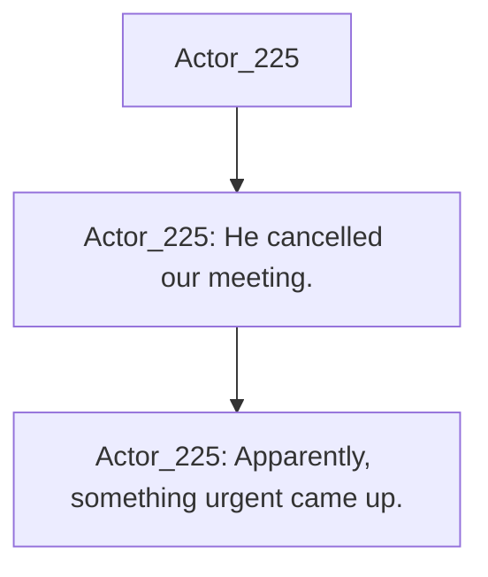

# Characters/Geraud

```mermaid
graph TD
    226_0["Actor_225"]
    226_1["Actor_225: He cancelled our meeting."]
    226_2["Actor_225: Apparently, something urgent came up."]
    226_0 --> 226_1
    226_1 --> 226_2
```