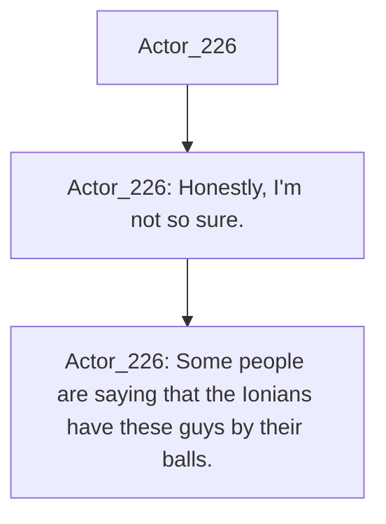

# Characters/Gergely

```mermaid
graph TD
    227_0["Actor_226"]
    227_1["Actor_226: Honestly, I'm not so sure."]
    227_2["Actor_226: Some people are saying that the Ionians have these guys by their balls."]
    227_0 --> 227_1
    227_1 --> 227_2
```