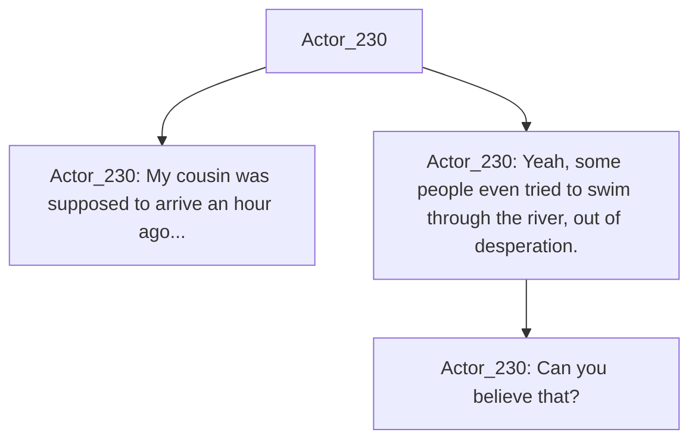

# Characters/Grady

```mermaid
graph TD
    231_0["Actor_230"]
    231_1["Actor_230: My cousin was supposed to arrive an hour ago..."]
    231_2["Actor_230: Yeah, some people even tried to swim through the river, out of desperation."]
    231_3["Actor_230: Can you believe that?"]
    231_0 --> 231_1
    231_0 --> 231_2
    231_2 --> 231_3
```