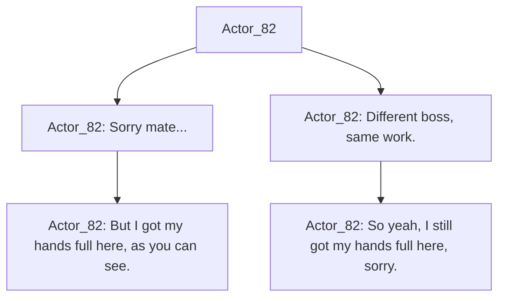

# Characters/Grigor

```mermaid
graph TD
    234_0["Actor_82"]
    234_1["Actor_82: Sorry mate..."]
    234_2["Actor_82: But I got my hands full here, as you can see."]
    234_3["Actor_82: Different boss, same work."]
    234_4["Actor_82: So yeah, I still got my hands full here, sorry."]
    234_0 --> 234_1
    234_0 --> 234_3
    234_1 --> 234_2
    234_3 --> 234_4
```