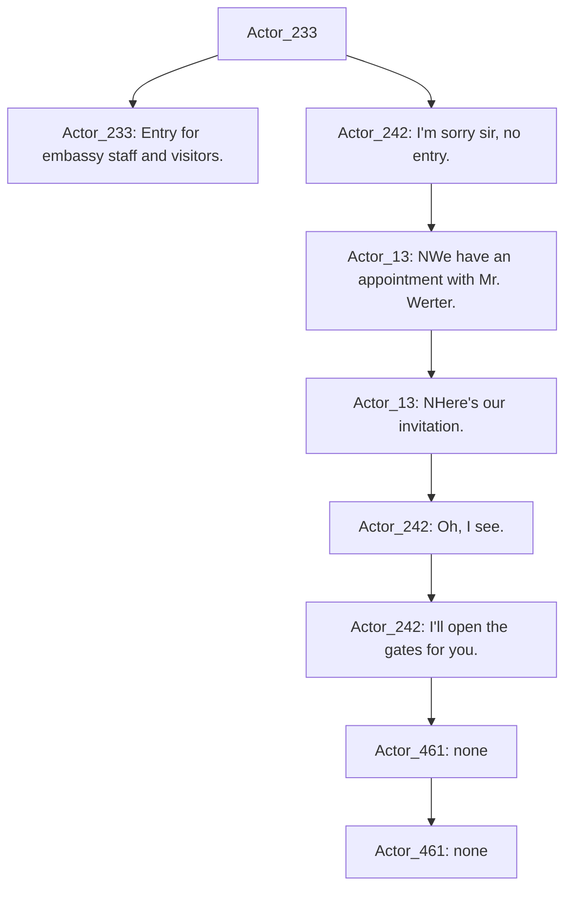

# Characters/Gunvor

```mermaid
graph TD
    236_0["Actor_233"]
    236_1["Actor_233: Entry for embassy staff and visitors."]
    236_2["Actor_242: I'm sorry sir, no entry."]
    236_3["Actor_13: NWe have an appointment with Mr. Werter."]
    236_4["Actor_13: NHere's our invitation."]
    236_5["Actor_242: Oh, I see."]
    236_6["Actor_242: I'll open the gates for you."]
    236_7["Actor_461: none"]
    236_8["Actor_461: none"]
    236_0 --> 236_1
    236_0 --> 236_2
    236_2 --> 236_3
    236_3 --> 236_4
    236_4 --> 236_5
    236_5 --> 236_6
    236_6 --> 236_7
    236_7 --> 236_8
```