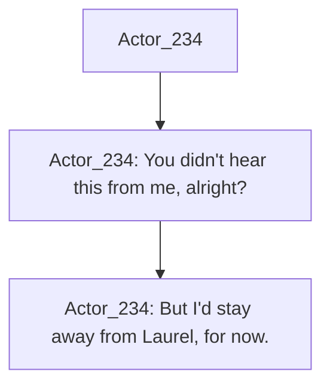

# Characters/Gus

```mermaid
graph TD
    237_0["Actor_234"]
    237_1["Actor_234: You didn't hear this from me, alright?"]
    237_2["Actor_234: But I'd stay away from Laurel, for now."]
    237_0 --> 237_1
    237_1 --> 237_2
```