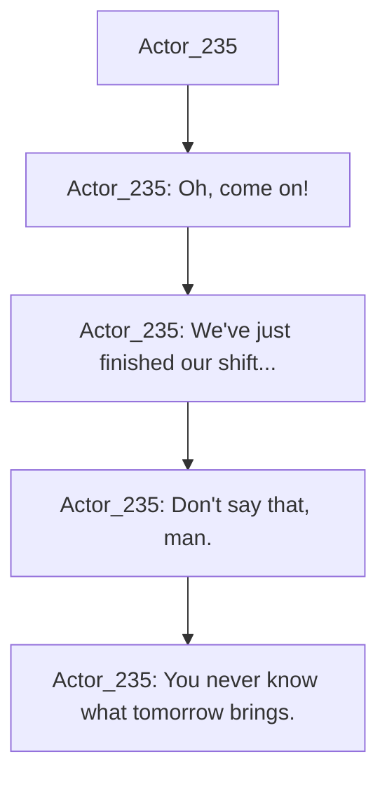

# Characters/Gusztáv

```mermaid
graph TD
    238_0["Actor_235"]
    238_1["Actor_235: Oh, come on!"]
    238_2["Actor_235: We've just finished our shift..."]
    238_3["Actor_235: Don't say that, man."]
    238_4["Actor_235: You never know what tomorrow brings."]
    238_0 --> 238_1
    238_1 --> 238_2
    238_2 --> 238_3
    238_3 --> 238_4
```