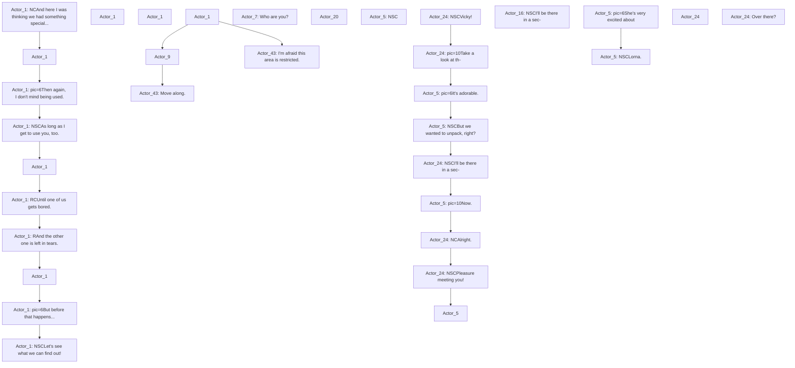

# Characters/Halim

```mermaid
graph TD
    62_0["Actor_1"]
    62_1["Actor_43: I'm afraid this area is restricted."]
    62_19["Actor_1"]
    62_26["Actor_1"]
    62_29["Actor_1: NCAnd here I was thinking we had something special..."]
    62_30["Actor_1"]
    62_31["Actor_1: pic=6Then again, I don't mind being used."]
    62_32["Actor_1: NSCAs long as I get to use you, too."]
    62_33["Actor_1"]
    62_34["Actor_1: pic=6But before that happens..."]
    62_36["Actor_1: NSCLet's see what we can find out!"]
    62_40["Actor_1: RCUntil one of us gets bored."]
    62_41["Actor_1: RAnd the other one is left in tears."]
    62_42["Actor_1"]
    62_75["Actor_7: Who are you?"]
    62_80["Actor_20"]
    62_83["Actor_9"]
    62_86["Actor_5: NSC"]
    62_88["Actor_5: NSCLorna."]
    62_90["Actor_24: NSCVicky!"]
    62_91["Actor_24: pic=10Take a look at th-"]
    62_92["Actor_5: pic=6It's adorable."]
    62_93["Actor_5: NSCBut we wanted to unpack, right?"]
    62_94["Actor_24: NSCI'll be there in a sec-"]
    62_95["Actor_5: pic=10Now."]
    62_96["Actor_16: NSCI'll be there in a sec-"]
    62_97["Actor_24: NCAlright."]
    62_98["Actor_24: NSCPleasure meeting you!"]
    62_102["Actor_5: pic=6She's very excited about "]
    62_104["Actor_24"]
    62_110["Actor_24: Over there?"]
    62_146["Actor_5"]
    62_149["Actor_43: Move along."]
    62_0 --> 62_83
    62_0 --> 62_1
    62_29 --> 62_30
    62_30 --> 62_31
    62_31 --> 62_32
    62_32 --> 62_33
    62_33 --> 62_40
    62_34 --> 62_36
    62_40 --> 62_41
    62_41 --> 62_42
    62_42 --> 62_34
    62_83 --> 62_149
    62_90 --> 62_91
    62_91 --> 62_92
    62_92 --> 62_93
    62_93 --> 62_94
    62_94 --> 62_95
    62_95 --> 62_97
    62_97 --> 62_98
    62_98 --> 62_146
    62_102 --> 62_88
```