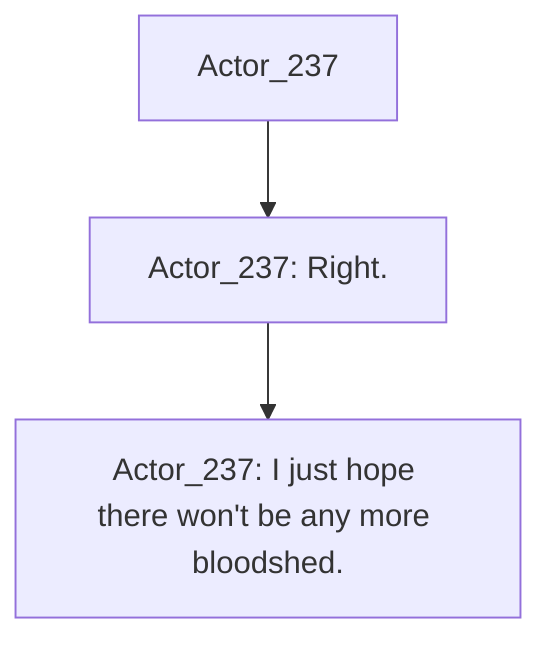

# Characters/Haris

```mermaid
graph TD
    240_0["Actor_237"]
    240_1["Actor_237: Right."]
    240_2["Actor_237: I just hope there won't be any more bloodshed."]
    240_0 --> 240_1
    240_1 --> 240_2
```