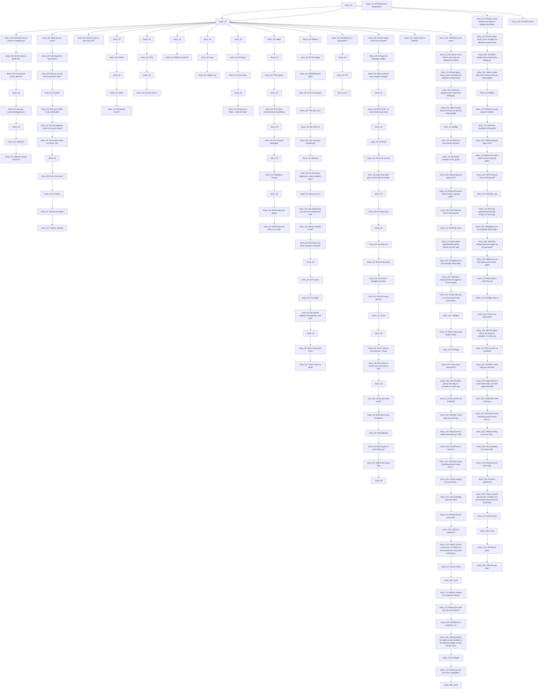

# Characters/Heinrich

```mermaid
graph TD
    81_0["Actor_16"]
    81_1["Actor_241: NYeah?"]
    81_1["Actor_16"]
    81_2["Actor_241: NPWhat do you want?"]
    81_3["Actor_13: NCThat's a nice uniform you have on display over there."]
    81_4["Actor_13: NFrom what I know, you're normally not allowed to keep those."]
    81_5["Actor_241: NCSome people have a hard time letting go."]
    81_6["Actor_241: NBut I doubt that you're here to discuss memorabilia."]
    81_7["Actor_13: NRight."]
    81_8["Actor_13: NCThere's a man named Heinrich."]
    81_9["Actor_13: NA former member of the guard."]
    81_10["Actor_241: NWho told you about him?"]
    81_11["Actor_13: NDoes the name Julius Gaston ring any bells?"]
    81_12["Actor_241: NPCThat old fool is still around?"]
    81_13["Actor_13: NCPartly, yeah."]
    81_14["Actor_13: NHe's been apprehended by the Guard, an hour ago."]
    81_15["Actor_241: NHappens to a lot of people these days."]
    81_16["Actor_241: NPCHe's always been too eager for his own good."]
    81_17["Actor_241: NCBut that too, is not the reason why you're here."]
    81_18["Actor_241: NRight?"]
    81_19["Actor_13: NWe need to get inside Trachi."]
    81_20["Actor_13: NCToday."]
    81_21["Actor_241: NYou sure about that?"]
    81_22["Actor_241: NPCI'd rather get as far away as possible, if I were you."]
    81_23["Actor_13: NCIt's not for us to decide."]
    81_24["Actor_241: NCWell, I can't help you with that."]
    81_25["Actor_241: NBut there's a small community up north."]
    81_26["Actor_241: NCTell them I sent you."]
    81_27["Actor_241: NPCDon't know if anything good comes from it..."]
    81_28["Actor_241: NCBut seeing as you're here..."]
    81_29["Actor_241: NIt's probably your best shot."]
    81_30["Actor_13: NThank you for your help."]
    81_31["Actor_241: NCDon't mention it!"]
    81_32["Actor_241: NNow, if you'd excuse me, I'd rather not be involved any more than necessary."]
    81_33["Actor_13: NCOf course."]
    81_34["Actor_461: none"]
    81_35["Actor_13: NWe're looking for Lieutenant Tanner."]
    81_36["Actor_13: NHave you seen him, by any chance?"]
    81_37["Actor_241: NPCNot in a long time, no."]
    81_38["Actor_241: NPAnd frankly, he might as well smolder in the deepest depths of hell, for all I care."]
    81_39["Actor_13: NCAlright."]
    81_40["Actor_13: NThank you for your time, regardless."]
    81_41["Actor_461: none"]
    81_42["Actor_13: NThat's a nice uniform you have on display over there."]
    81_43["Actor_13: NFrom what I know, you're usually not allowed to keep those."]
    81_44["Actor_241: NCSome people have a hard time letting go."]
    81_45["Actor_241: NBut I doubt that you're here to discuss memorabilia."]
    81_46["Actor_13: NRight."]
    81_47["Actor_13: NThere's a man named Heinrich."]
    81_48["Actor_13: NA former member of the guard."]
    81_49["Actor_241: NWho told you about him?"]
    81_50["Actor_13: NDoes the name Julius Gaston ring any bells?"]
    81_51["Actor_241: NPCThat old fool is still around?"]
    81_52["Actor_13: NCPartly, yes."]
    81_53["Actor_13: NHe was apprehended by the Guard, an hour ago."]
    81_54["Actor_241: NHappens to a lot of people these days."]
    81_55["Actor_241: NPCHe's always been too eager for his own good."]
    81_56["Actor_241: NBut he's not the reason you're here, right?"]
    81_57["Actor_13: NWe need to enter the city."]
    81_58["Actor_13: NCToday, that is."]
    81_59["Actor_241: NYou sure about that?"]
    81_60["Actor_241: NPCI'd rather get as far away as possible, if I were you."]
    81_61["Actor_13: NCIt's not for us to decide."]
    81_62["Actor_241: NCWell, I can't help you with that."]
    81_63["Actor_241: NBut there's a small community up north, called Nestville."]
    81_64["Actor_241: NTell them that I sent you."]
    81_65["Actor_241: NPCDon't know if anything good comes from it..."]
    81_66["Actor_241: NCBut seeing as you're here..."]
    81_67["Actor_241: NIt's probably your best shot."]
    81_68["Actor_13: NThank you for your help."]
    81_69["Actor_241: NCDon't mention it!"]
    81_70["Actor_241: NNow, if you'd excuse me, I'd rather not be involved any more than necessary."]
    81_71["Actor_13: NCOf course."]
    81_72["Actor_461: none"]
    81_73["Actor_241: NPCWe're done."]
    81_74["Actor_241: NI'll see you later."]
    81_75["Actor_241: NCWe're done."]
    81_167["Actor_16: NSThank you so much for helping out!"]
    81_176["Actor_16: NHey."]
    81_177["Actor_55: NCNo need to thank me."]
    81_178["Actor_55: It's my front-porch, after all."]
    81_179["Actor_16: SBut I need to say a couple of things."]
    81_180["Actor_16: NCFirst off: I'm sorry I broke your door."]
    81_181["Actor_16"]
    81_182["Actor_55: Not your personal playground."]
    81_183["Actor_55"]
    81_184["Actor_16: SWHuh?"]
    81_185["Actor_16: SWhat's wrong with him?"]
    81_186["Actor_55: What do you want?"]
    81_187["Actor_16: NSI wanted to say thanks!"]
    81_188["Actor_55: NCCan you do that somewhere else?"]
    81_190["Actor_16: SCJeez."]
    81_191["Actor_55: NI'll be whatever I want in my own house!"]
    81_192["Actor_55: Weren't you on your way out?"]
    81_193["Actor_16: NPCWhat am I doing here?"]
    81_194["Actor_55: NCHow many hints do you need?"]
    81_195["Actor_16: SCI got the message, alright."]
    81_196["Actor_55: NAre you done?"]
    81_198["Actor_16: SCYeah."]
    81_199["Actor_16: SDo you HAVE to be unfriendly?"]
    81_200["Actor_16: SYou were a jerk out there, too!"]
    81_201["Actor_55"]
    81_202["Actor_16: SSorry to intrude."]
    81_203["Actor_16: Thanks, anyway."]
    81_204["Actor_16: SHuh?"]
    81_205["Actor_16"]
    81_206["Actor_16: Hello?"]
    81_207["Actor_16: RAnybody home?"]
    81_208["Actor_16: SYo!"]
    81_209["Actor_16"]
    81_210["Actor_16: What's he up to?"]
    81_211["Actor_16"]
    81_212["Actor_16: Hey!"]
    81_213["Actor_16"]
    81_214["Actor_16: SOpen up!"]
    81_215["Actor_16: SCOkay."]
    81_216["Actor_16"]
    81_217["Actor_16: SI've had it."]
    81_218["Actor_16"]
    81_219["Actor_16: SIf you're in there – clear the door!"]
    81_220["Actor_16"]
    81_221["Actor_16: RHe's gone."]
    81_222["Actor_16"]
    81_223["Actor_16: NCI wish I could've done something."]
    81_224["Actor_16: NSHey!"]
    81_225["Actor_16"]
    81_226["Actor_16: ROr at least apologize."]
    81_227["Actor_16"]
    81_228["Actor_16: NWWait a minute!"]
    81_229["Actor_16"]
    81_230["Actor_16"]
    81_231["Actor_16: Are you there?"]
    81_232["Actor_16: NSYou stay put, okay?"]
    81_233["Actor_16: NGDI'll get you back in no time!"]
    81_234["Actor_55: NCYou again."]
    81_235["Actor_16: NGDWelcome back!"]
    81_236["Actor_55: NCLet me guess."]
    81_237["Actor_55: That was you?"]
    81_238["Actor_16: NSI think so!"]
    81_239["Actor_55: Can I ask you something?"]
    81_240["Actor_16: NSSure!"]
    81_241["Actor_55: Do you enjoy stepping on other people's toes?"]
    81_242["Actor_16: SExcuse me?"]
    81_243["Actor_55: I am asking why you won't let a dead man rest."]
    81_244["Actor_16: NWYou wanted to die?"]
    81_245["Actor_55: NCIf that's the price of peace and quiet."]
    81_246["Actor_16"]
    81_247["Actor_16: RI'm sorry."]
    81_248["Actor_55: It's alright."]
    81_249["Actor_55: NCJust let bygones be bygones, next time."]
    81_250["Actor_16"]
    81_251["Actor_55: Now, if you don't mind."]
    81_252["Actor_55: I have a door to repair."]
    81_254["Actor_16"]
    81_255["Actor_16: NC"]
    81_256["Actor_16: N"]
    81_257["Actor_16"]
    81_259["Actor_16"]
    81_260["Actor_55: NCAnd?"]
    81_261["Actor_16: SCYou're an ass."]
    81_262["Actor_16: SBut that didn't give me the right to intrude."]
    81_263["Actor_16"]
    81_264["Actor_55: NCThank you."]
    81_265["Actor_16"]
    81_266["Actor_55: NIf that's all-"]
    81_267["Actor_16: NCOne last thing."]
    81_268["Actor_16: NI'm sorry I brought you back."]
    81_269["Actor_55: NCDon't worry about it."]
    81_270["Actor_16: SI do!"]
    81_271["Actor_16"]
    81_272["Actor_55: NCan you work wood?"]
    81_273["Actor_16: NGDI know how to break it!"]
    81_274["Actor_55: NCEvidently."]
    81_275["Actor_16: NSI'm quick to pick things up!"]
    81_276["Actor_55: NWe'll see about that."]
    81_277["Actor_16"]
    81_278["Actor_16: SPCWhat am I doing here?"]
    81_279["Actor_16: I should talk to Dorothy."]
    81_280["Actor_55"]
    81_283["Actor_16: NCIt's none of my business, I know."]
    81_284["Actor_16: But is there a reason why you want to die?"]
    81_285["Actor_16"]
    81_0 --> 81_1
    81_0 --> 81_1
    81_0 --> 81_42
    81_0 --> 81_75
    81_1 --> 81_167
    81_1 --> 81_186
    81_1 --> 81_192
    81_1 --> 81_277
    81_1 --> 81_209
    81_1 --> 81_211
    81_1 --> 81_213
    81_1 --> 81_216
    81_1 --> 81_176
    81_1 --> 81_224
    81_1 --> 81_193
    81_1 --> 81_194
    81_1 --> 81_279
    81_1 --> 81_2
    81_2 --> 81_3
    81_3 --> 81_4
    81_4 --> 81_5
    81_5 --> 81_6
    81_6 --> 81_7
    81_7 --> 81_8
    81_8 --> 81_9
    81_9 --> 81_10
    81_10 --> 81_11
    81_11 --> 81_12
    81_12 --> 81_13
    81_13 --> 81_14
    81_14 --> 81_15
    81_15 --> 81_16
    81_16 --> 81_17
    81_17 --> 81_18
    81_18 --> 81_19
    81_19 --> 81_20
    81_20 --> 81_21
    81_21 --> 81_22
    81_22 --> 81_23
    81_23 --> 81_24
    81_24 --> 81_25
    81_25 --> 81_26
    81_26 --> 81_27
    81_27 --> 81_28
    81_28 --> 81_29
    81_29 --> 81_30
    81_30 --> 81_31
    81_31 --> 81_32
    81_32 --> 81_33
    81_33 --> 81_34
    81_34 --> 81_35
    81_35 --> 81_36
    81_36 --> 81_37
    81_37 --> 81_38
    81_38 --> 81_39
    81_39 --> 81_40
    81_40 --> 81_41
    81_42 --> 81_43
    81_43 --> 81_44
    81_44 --> 81_45
    81_45 --> 81_46
    81_46 --> 81_47
    81_47 --> 81_48
    81_48 --> 81_49
    81_49 --> 81_50
    81_50 --> 81_51
    81_51 --> 81_52
    81_52 --> 81_53
    81_53 --> 81_54
    81_54 --> 81_55
    81_55 --> 81_56
    81_56 --> 81_57
    81_57 --> 81_58
    81_58 --> 81_59
    81_59 --> 81_60
    81_60 --> 81_61
    81_61 --> 81_62
    81_62 --> 81_63
    81_63 --> 81_64
    81_64 --> 81_65
    81_65 --> 81_66
    81_66 --> 81_67
    81_67 --> 81_68
    81_68 --> 81_69
    81_69 --> 81_70
    81_70 --> 81_71
    81_71 --> 81_72
    81_72 --> 81_73
    81_73 --> 81_74
    81_167 --> 81_177
    81_176 --> 81_220
    81_177 --> 81_178
    81_178 --> 81_181
    81_179 --> 81_257
    81_180 --> 81_259
    81_181 --> 81_182
    81_182 --> 81_183
    81_183 --> 81_184
    81_184 --> 81_185
    81_186 --> 81_187
    81_187 --> 81_188
    81_188 --> 81_190
    81_190 --> 81_199
    81_191 --> 81_200
    81_193 --> 81_254
    81_194 --> 81_195
    81_195 --> 81_179
    81_196 --> 81_198
    81_198 --> 81_202
    81_199 --> 81_191
    81_200 --> 81_201
    81_201 --> 81_196
    81_202 --> 81_203
    81_204 --> 81_205
    81_205 --> 81_206
    81_206 --> 81_207
    81_208 --> 81_230
    81_209 --> 81_208
    81_211 --> 81_210
    81_212 --> 81_214
    81_213 --> 81_212
    81_215 --> 81_217
    81_216 --> 81_215
    81_217 --> 81_218
    81_218 --> 81_219
    81_220 --> 81_221
    81_221 --> 81_222
    81_222 --> 81_223
    81_223 --> 81_225
    81_224 --> 81_234
    81_225 --> 81_226
    81_226 --> 81_227
    81_227 --> 81_228
    81_228 --> 81_229
    81_229 --> 81_232
    81_230 --> 81_231
    81_232 --> 81_233
    81_234 --> 81_235
    81_235 --> 81_236
    81_236 --> 81_237
    81_237 --> 81_238
    81_238 --> 81_239
    81_239 --> 81_240
    81_240 --> 81_241
    81_241 --> 81_242
    81_242 --> 81_243
    81_243 --> 81_244
    81_244 --> 81_245
    81_245 --> 81_246
    81_246 --> 81_247
    81_247 --> 81_248
    81_248 --> 81_249
    81_249 --> 81_250
    81_250 --> 81_251
    81_251 --> 81_252
    81_254 --> 81_255
    81_255 --> 81_256
    81_257 --> 81_180
    81_259 --> 81_260
    81_260 --> 81_261
    81_261 --> 81_262
    81_262 --> 81_263
    81_263 --> 81_264
    81_264 --> 81_265
    81_265 --> 81_266
    81_266 --> 81_267
    81_267 --> 81_268
    81_268 --> 81_269
    81_269 --> 81_270
    81_270 --> 81_271
    81_271 --> 81_283
    81_272 --> 81_273
    81_273 --> 81_274
    81_274 --> 81_275
    81_275 --> 81_276
    81_276 --> 81_280
    81_277 --> 81_204
    81_283 --> 81_284
    81_284 --> 81_285
    81_285 --> 81_272
```