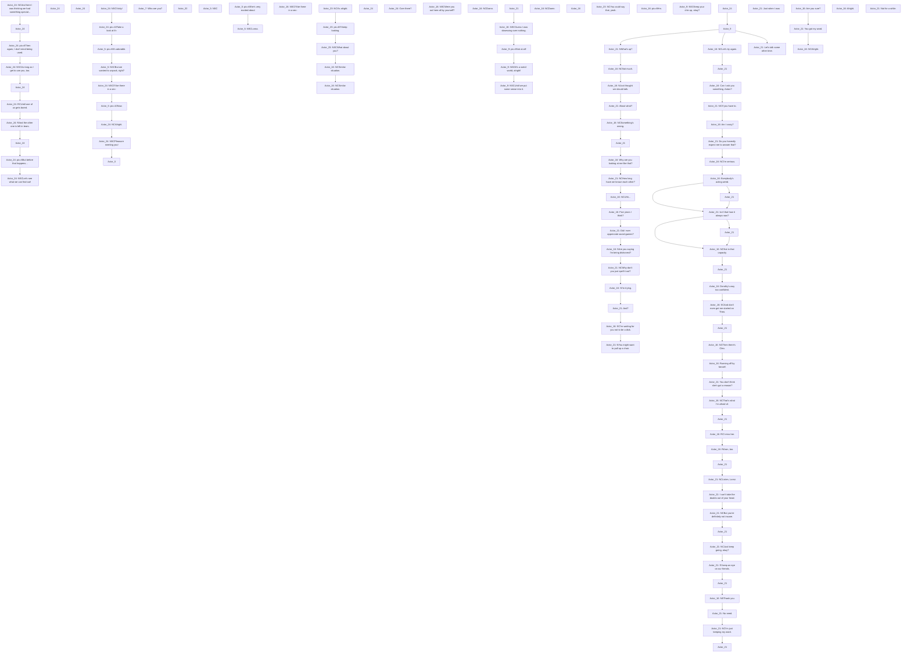

# Characters/Helios

```mermaid
graph TD
    57_0["Actor_24"]
    57_19["Actor_24"]
    57_26["Actor_24"]
    57_29["Actor_24: NCAnd here I was thinking we had something special..."]
    57_30["Actor_24"]
    57_31["Actor_24: pic=6Then again, I don't mind being used."]
    57_32["Actor_24: NSCAs long as I get to use you, too."]
    57_33["Actor_24"]
    57_34["Actor_24: pic=6But before that happens..."]
    57_36["Actor_24: NSCLet's see what we can find out!"]
    57_40["Actor_24: RCUntil one of us gets bored."]
    57_41["Actor_24: RAnd the other one is left in tears."]
    57_42["Actor_24"]
    57_75["Actor_7: Who are you?"]
    57_80["Actor_20"]
    57_83["Actor_9"]
    57_86["Actor_5: NSC"]
    57_88["Actor_5: NSCLorna."]
    57_90["Actor_24: NSCVicky!"]
    57_91["Actor_24: pic=10Take a look at th-"]
    57_92["Actor_5: pic=6It's adorable."]
    57_93["Actor_5: NSCBut we wanted to unpack, right?"]
    57_94["Actor_24: NSCI'll be there in a sec-"]
    57_95["Actor_5: pic=10Now."]
    57_96["Actor_16: NSCI'll be there in a sec-"]
    57_97["Actor_24: NCAlright."]
    57_98["Actor_24: NSCPleasure meeting you!"]
    57_102["Actor_5: pic=6She's very excited about "]
    57_104["Actor_24"]
    57_110["Actor_24: Over there?"]
    57_146["Actor_5"]
    57_149["Actor_21: NWhat's up?"]
    57_156["Actor_16: NSCWere you out here all by yourself?"]
    57_159["Actor_16: NCDamn."]
    57_160["Actor_23: NCIt's alright."]
    57_161["Actor_16: NCDamn."]
    57_162["Actor_23: pic=6I'll keep looking."]
    57_163["Actor_23: NSCWhat about you?"]
    57_166["Actor_16: NCSimilar situation."]
    57_167["Actor_16: NCSimilar situation."]
    57_168["Actor_16"]
    57_172["Actor_23: NCYou could say that, yeah."]
    57_174["Actor_16: pic=6Hm."]
    57_203["Actor_16: NCNot much."]
    57_213["Actor_16: NJust thought we should talk."]
    57_214["Actor_21: About what?"]
    57_215["Actor_16: Why are you looking at me like that?"]
    57_216["Actor_9: NSCKeep your chin up, okay?"]
    57_217["Actor_21: NCHow long have we known each other?"]
    57_218["Actor_16: NCUhh..."]
    57_220["Actor_16: Five years I think?"]
    57_221["Actor_21: Did I ever appreciate social-games?"]
    57_225["Actor_16: SAre you saying I'm being dishonest?"]
    57_226["Actor_21: NCWhy don't you just spell it out?"]
    57_227["Actor_16: SI'm trying."]
    57_229["Actor_21"]
    57_230["Actor_16: NSCGuess I was obsessing over nothing."]
    57_231["Actor_9: pic=6Not at all!"]
    57_232["Actor_9: NGDIt's a weird world, alright!"]
    57_233["Actor_9: NSCUntil we put some sense into it."]
    57_234["Actor_21"]
    57_235["Actor_21: And?"]
    57_236["Actor_21: Just when I was "]
    57_237["Actor_16: SCI'm waiting for you not to be a dick."]
    57_238["Actor_21: NYou might want to pull up a chair."]
    57_239["Actor_16: NCLet's try again."]
    57_240["Actor_16: Can I ask you something, Anton?"]
    57_241["Actor_21: NCIf you have to."]
    57_242["Actor_16: Am I crazy?"]
    57_243["Actor_21: Do you honestly expect me to answer that?"]
    57_244["Actor_16: NCI'm serious."]
    57_245["Actor_21: Isn't that how it always was?"]
    57_246["Actor_21"]
    57_247["Actor_16: Everybody's acting weird."]
    57_248["Actor_16: NCNot in that capacity."]
    57_249["Actor_21"]
    57_250["Actor_21"]
    57_251["Actor_21: I can't take the doubts out of your head."]
    57_252["Actor_21: NCBut you're definitely not insane."]
    57_253["Actor_21"]
    57_254["Actor_21: NCJust keep going, okay?"]
    57_255["Actor_21: I'll keep an eye on our friends."]
    57_256["Actor_16: Are you sure?"]
    57_257["Actor_21: You got my word."]
    57_258["Actor_16: NCAlright."]
    57_259["Actor_16: Alright."]
    57_260["Actor_16: Dorothy's way too confident."]
    57_261["Actor_16: SCAnd don't even get me started on Theo."]
    57_262["Actor_21"]
    57_263["Actor_21"]
    57_264["Actor_16: NSThank you."]
    57_265["Actor_21: No need."]
    57_266["Actor_21: NCI'm just keeping my word."]
    57_267["Actor_21"]
    57_269["Actor_21: Let's talk some other time."]
    57_270["Actor_16: NCSomething's wrong."]
    57_271["Actor_21"]
    57_272["Actor_16: NCThen there's Cleo."]
    57_273["Actor_16: Running off by herself."]
    57_274["Actor_21: You don't think she's got a reason?"]
    57_275["Actor_21: Not for a while."]
    57_276["Actor_16: NCThat's what I'm afraid of."]
    57_277["Actor_21"]
    57_278["Actor_16: RCI miss her."]
    57_279["Actor_16: RAron, too."]
    57_280["Actor_21: NCListen, Lornz."]
    57_281["Actor_21"]
    57_0 --> 57_83
    57_29 --> 57_30
    57_30 --> 57_31
    57_31 --> 57_32
    57_32 --> 57_33
    57_33 --> 57_40
    57_34 --> 57_36
    57_40 --> 57_41
    57_41 --> 57_42
    57_42 --> 57_34
    57_83 --> 57_149
    57_83 --> 57_239
    57_83 --> 57_269
    57_90 --> 57_91
    57_91 --> 57_92
    57_92 --> 57_93
    57_93 --> 57_94
    57_94 --> 57_95
    57_95 --> 57_97
    57_97 --> 57_98
    57_98 --> 57_146
    57_102 --> 57_88
    57_149 --> 57_203
    57_160 --> 57_162
    57_162 --> 57_163
    57_163 --> 57_166
    57_166 --> 57_167
    57_203 --> 57_213
    57_213 --> 57_214
    57_214 --> 57_270
    57_215 --> 57_217
    57_217 --> 57_218
    57_218 --> 57_220
    57_220 --> 57_221
    57_221 --> 57_225
    57_225 --> 57_226
    57_226 --> 57_227
    57_227 --> 57_235
    57_229 --> 57_230
    57_230 --> 57_231
    57_231 --> 57_232
    57_232 --> 57_233
    57_234 --> 57_215
    57_235 --> 57_237
    57_237 --> 57_238
    57_239 --> 57_271
    57_240 --> 57_241
    57_241 --> 57_242
    57_242 --> 57_243
    57_243 --> 57_244
    57_244 --> 57_247
    57_245 --> 57_248
    57_245 --> 57_249
    57_246 --> 57_245
    57_247 --> 57_245
    57_247 --> 57_246
    57_248 --> 57_262
    57_249 --> 57_248
    57_250 --> 57_272
    57_251 --> 57_252
    57_252 --> 57_253
    57_253 --> 57_254
    57_254 --> 57_255
    57_255 --> 57_263
    57_256 --> 57_257
    57_257 --> 57_258
    57_260 --> 57_261
    57_261 --> 57_250
    57_262 --> 57_260
    57_263 --> 57_264
    57_264 --> 57_265
    57_265 --> 57_266
    57_266 --> 57_267
    57_270 --> 57_234
    57_271 --> 57_240
    57_272 --> 57_273
    57_273 --> 57_274
    57_274 --> 57_276
    57_276 --> 57_277
    57_277 --> 57_278
    57_278 --> 57_279
    57_279 --> 57_281
    57_280 --> 57_251
    57_281 --> 57_280
```