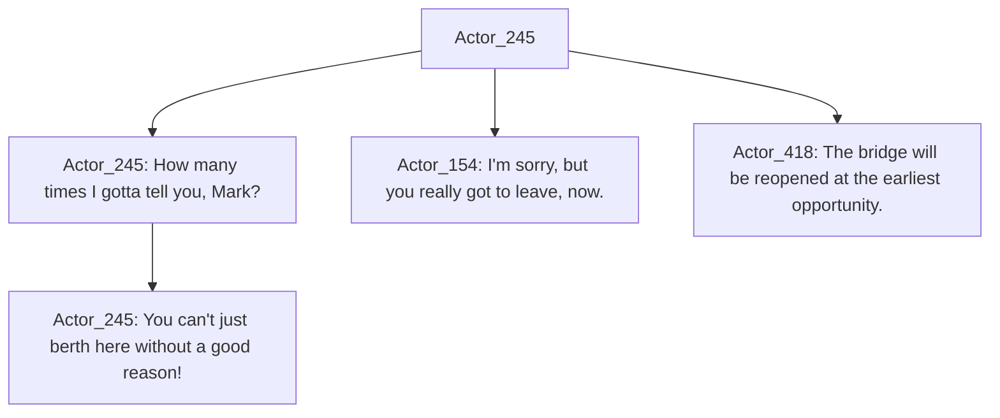

# Characters/Hervey

```mermaid
graph TD
    247_0["Actor_245"]
    247_1["Actor_245: How many times I gotta tell you, Mark?"]
    247_2["Actor_245: You can't just berth here without a good reason!"]
    247_3["Actor_154: I'm sorry, but you really got to leave, now."]
    247_4["Actor_418: The bridge will be reopened at the earliest opportunity."]
    247_0 --> 247_1
    247_0 --> 247_3
    247_0 --> 247_4
    247_1 --> 247_2
```