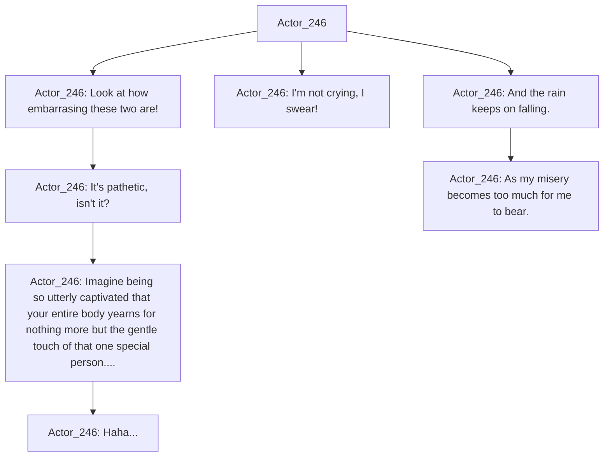

# Characters/Heta

```mermaid
graph TD
    248_0["Actor_246"]
    248_1["Actor_246: Look at how embarrasing these two are!"]
    248_2["Actor_246: It's pathetic, isn't it?"]
    248_3["Actor_246: Imagine being so utterly captivated that your entire body yearns for nothing more but the gentle touch of that one special person...."]
    248_4["Actor_246: Haha..."]
    248_5["Actor_246: I'm not crying, I swear!"]
    248_6["Actor_246: And the rain keeps on falling."]
    248_7["Actor_246: As my misery becomes too much for me to bear."]
    248_0 --> 248_1
    248_0 --> 248_5
    248_0 --> 248_6
    248_1 --> 248_2
    248_2 --> 248_3
    248_3 --> 248_4
    248_6 --> 248_7
```