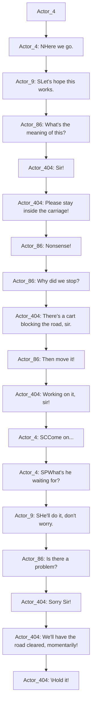

# Characters/Icarus

```mermaid
graph TD
    251_0["Actor_4"]
    251_1["Actor_4: NHere we go."]
    251_2["Actor_9: SLet's hope this works."]
    251_3["Actor_86: What's the meaning of this?"]
    251_4["Actor_404: Sir!"]
    251_5["Actor_404: Please stay inside the carriage!"]
    251_6["Actor_86: Nonsense!"]
    251_7["Actor_86: Why did we stop?"]
    251_8["Actor_404: There's a cart blocking the road, sir."]
    251_9["Actor_86: Then move it!"]
    251_10["Actor_404: Working on it, sir!"]
    251_11["Actor_4: SCCome on..."]
    251_12["Actor_4: SPWhat's he waiting for?"]
    251_13["Actor_9: SHe'll do it, don't worry."]
    251_14["Actor_86: Is there a problem?"]
    251_15["Actor_404: Sorry Sir!"]
    251_16["Actor_404: We'll have the road cleared, momentarily!"]
    251_17["Actor_404: \Hold it!"]
    251_0 --> 251_1
    251_1 --> 251_2
    251_2 --> 251_3
    251_3 --> 251_4
    251_4 --> 251_5
    251_5 --> 251_6
    251_6 --> 251_7
    251_7 --> 251_8
    251_8 --> 251_9
    251_9 --> 251_10
    251_10 --> 251_11
    251_11 --> 251_12
    251_12 --> 251_13
    251_13 --> 251_14
    251_14 --> 251_15
    251_15 --> 251_16
    251_16 --> 251_17
```