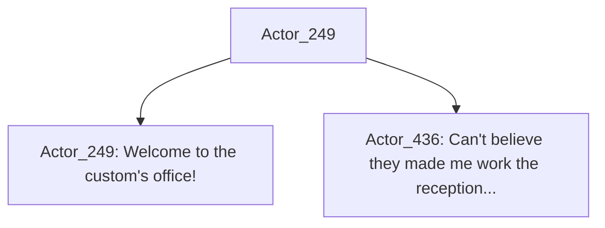

# Characters/Ida

```mermaid
graph TD
    252_0["Actor_249"]
    252_1["Actor_249: Welcome to the custom's office!"]
    252_2["Actor_436: Can't believe they made me work the reception..."]
    252_0 --> 252_1
    252_0 --> 252_2
```