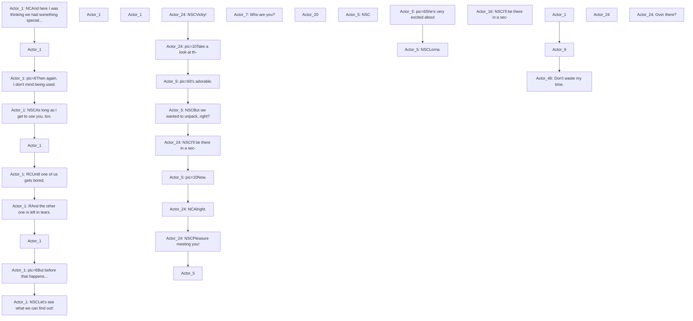

# Characters/Ilyas

```mermaid
graph TD
    69_0["Actor_1"]
    69_19["Actor_1"]
    69_26["Actor_1"]
    69_29["Actor_1: NCAnd here I was thinking we had something special..."]
    69_30["Actor_1"]
    69_31["Actor_1: pic=6Then again, I don't mind being used."]
    69_32["Actor_1: NSCAs long as I get to use you, too."]
    69_33["Actor_1"]
    69_34["Actor_1: pic=6But before that happens..."]
    69_36["Actor_1: NSCLet's see what we can find out!"]
    69_40["Actor_1: RCUntil one of us gets bored."]
    69_41["Actor_1: RAnd the other one is left in tears."]
    69_42["Actor_1"]
    69_75["Actor_7: Who are you?"]
    69_80["Actor_20"]
    69_83["Actor_9"]
    69_86["Actor_5: NSC"]
    69_88["Actor_5: NSCLorna."]
    69_90["Actor_24: NSCVicky!"]
    69_91["Actor_24: pic=10Take a look at th-"]
    69_92["Actor_5: pic=6It's adorable."]
    69_93["Actor_5: NSCBut we wanted to unpack, right?"]
    69_94["Actor_24: NSCI'll be there in a sec-"]
    69_95["Actor_5: pic=10Now."]
    69_96["Actor_16: NSCI'll be there in a sec-"]
    69_97["Actor_24: NCAlright."]
    69_98["Actor_24: NSCPleasure meeting you!"]
    69_102["Actor_5: pic=6She's very excited about "]
    69_104["Actor_24"]
    69_110["Actor_24: Over there?"]
    69_146["Actor_5"]
    69_149["Actor_46: Don't waste my time."]
    69_0 --> 69_83
    69_29 --> 69_30
    69_30 --> 69_31
    69_31 --> 69_32
    69_32 --> 69_33
    69_33 --> 69_40
    69_34 --> 69_36
    69_40 --> 69_41
    69_41 --> 69_42
    69_42 --> 69_34
    69_83 --> 69_149
    69_90 --> 69_91
    69_91 --> 69_92
    69_92 --> 69_93
    69_93 --> 69_94
    69_94 --> 69_95
    69_95 --> 69_97
    69_97 --> 69_98
    69_98 --> 69_146
    69_102 --> 69_88
```