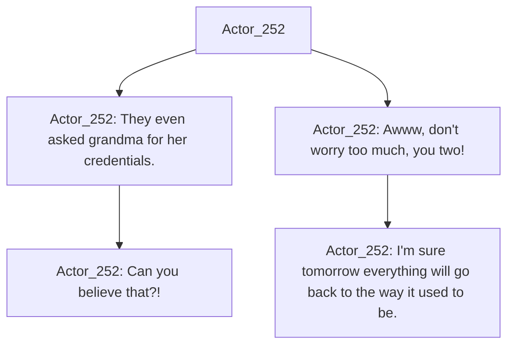

# Characters/Ingrid

```mermaid
graph TD
    255_0["Actor_252"]
    255_1["Actor_252: They even asked grandma for her credentials."]
    255_2["Actor_252: Can you believe that?!"]
    255_3["Actor_252: Awww, don't worry too much, you two!"]
    255_4["Actor_252: I'm sure tomorrow everything will go back to the way it used to be."]
    255_0 --> 255_1
    255_0 --> 255_3
    255_1 --> 255_2
    255_3 --> 255_4
```