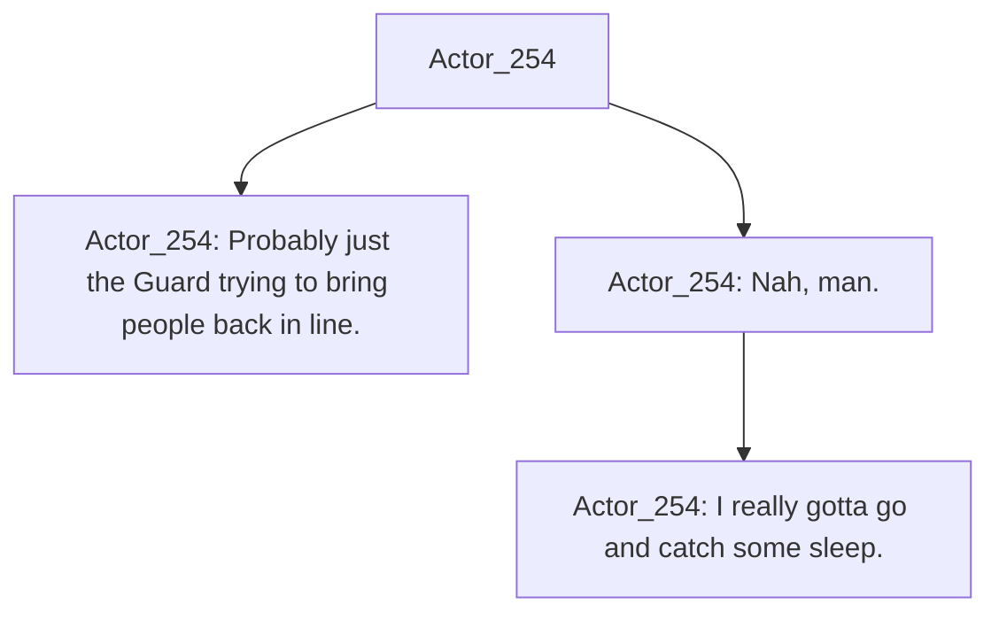

# Characters/Irvine

```mermaid
graph TD
    257_0["Actor_254"]
    257_1["Actor_254: Probably just the Guard trying to bring people back in line."]
    257_2["Actor_254: Nah, man."]
    257_3["Actor_254: I really gotta go and catch some sleep."]
    257_0 --> 257_1
    257_0 --> 257_2
    257_2 --> 257_3
```